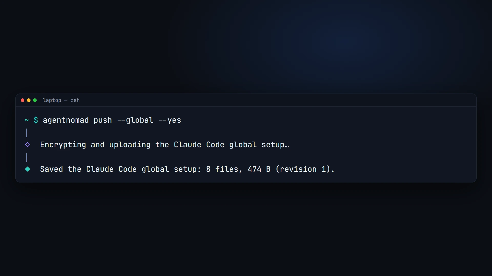
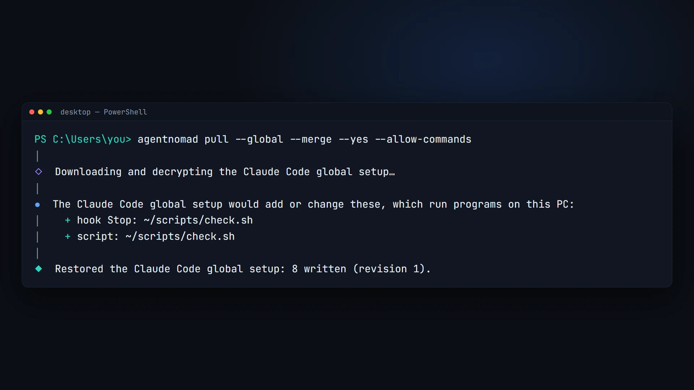
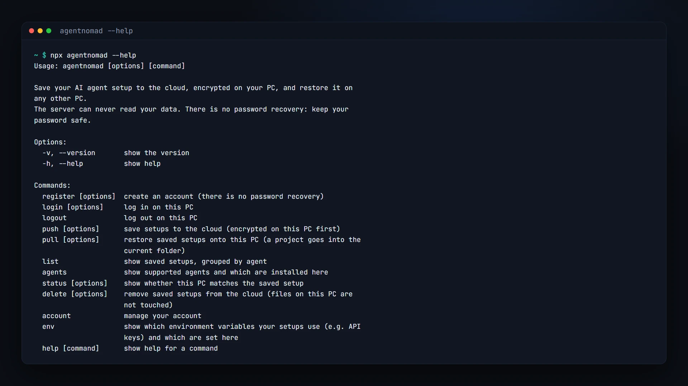

# agentnomad

[](https://www.npmjs.com/package/agentnomad)
[](https://github.com/A1X6/agent-nomad/actions/workflows/ci.yml)
[](LICENSE)

**Move your Claude Code setup to a new PC with one command.** Save your settings,
instructions, skills, subagents, commands, hooks, MCP servers and plugins from one machine
and restore them on another, on macOS, Linux and Windows. It is encrypted on your PC first:
the server can never read it.

<p align="center">
  
</p>

```sh
npm install -g agentnomad   # needs Node.js 22.13 or newer

# On your laptop
agentnomad register
agentnomad push

# On any other PC
agentnomad login
agentnomad pull
```

> **Status:** 1.0 supports Claude Code. More agents are next: see the [roadmap](#roadmap).

> **Feedback welcome!** Tried it? Tell me what broke or what you missed in
> [Issues](https://github.com/A1X6/agent-nomad/issues/new/choose), or ask and share ideas in
> [Discussions](https://github.com/A1X6/agent-nomad/discussions).

## See it work

**Push** on the PC that has your setup: it is collected, encrypted on the PC and uploaded.



**Pull** on any other PC, here Windows: anything that would run programs is listed first,
then the setup is restored with this PC's paths.



Every command, with `agentnomad --help`:



## Why

Rebuilding an agent setup by hand on every new machine is slow, and copying folders breaks:
paths differ between PCs and operating systems, secrets leak, and machine state (logins,
history, caches) comes along. agentnomad copies exactly the setup, rewrites paths for the
new PC, and shows you anything that would run programs before writing it.

## Features

- **Global and per-project setups.** Your `~/.claude` setup, and each project's
  `CLAUDE.md`, `.mcp.json` and `.claude/` folder, saved and restored separately.
- **Zero-knowledge.** Encrypted on your PC with a key derived from your password
  (Argon2id, XChaCha20-Poly1305). The server stores ciphertext only; even project names are
  hidden. There is no password recovery, which is what keeps it that way.
- **Works across operating systems.** Home paths are rewritten for the other PC, line
  endings and permissions are fixed per OS, and hooks that only run on the other OS are
  flagged.
- **Safe restores.** Identical files are left alone; different ones are merged, overwritten
  with a backup, or skipped: you choose, per file or for all. Pull never deletes files.
- **Nothing runs unseen.** Everything new or changed that Claude Code would run is listed and
  confirmed before it is written: hooks, the status line, MCP servers, settings that run a
  command (such as `apiKeyHelper`), the scripts they run, and skills, commands or subagents
  with commands that run by themselves. Commands written in a skill as instructions are never
  flagged.
- **Plugins reinstalled, not copied,** with Claude Code's own `claude plugin` commands.
- **Opt-in memory and secrets.** Include Claude's memory, and save environment variable
  values (such as API keys for MCP servers) inside the encrypted setup.
- **Your claude.ai skills too (opt-in).** Save a copy of the skills you made on claude.ai and
  add them as local skills on a PC that uses another claude.ai account, or none. Anthropic's
  are never saved, and neither are your organization's when Claude Code's files tell them
  apart; push names any skill it leaves out, and says when it cannot tell.
- **And your claude.ai plugins (opt-in).** Save a copy of the plugins you uploaded to
  claude.ai and add them as local plugins in `~/.claude/skills/` on a PC that uses another
  claude.ai account, or none. Plugins from claude.ai's directory or your organization, and
  ones claude.ai installs by itself, are never saved; push names each one it leaves out, and
  pull reviews each plugin before writing it.
- **Plugin data too (opt-in).** Save what your plugins and mods keep between sessions, such
  as a mod's saved choices, for the plugins the setup puts back; data a removed plugin left
  behind is never saved. Pull puts it back once the plugin is installed.
- **Scriptable.** Every command runs from a script or CI with flags and clear exit codes.

## Install

agentnomad needs [Node.js](https://nodejs.org) 22.13 or newer.

```sh
npm install -g agentnomad
```

Or run it without installing:

```sh
npx agentnomad pull
```

Every release is built and published by GitHub Actions with
[npm provenance](https://docs.npmjs.com/generating-provenance-statements), so you can check
that the package was built from this repository: `npm audit signatures`.

## Quick start

**1. On the PC that has your setup:**

```sh
agentnomad register   # choose a username and a strong password (no recovery!)
agentnomad push       # pick agents and scopes: global setup, this project, or both
```

Run `agentnomad push` inside a project folder to save that project's setup too. The first
time, you name the project; other PCs pick it by that name.

**2. On another PC:**

```sh
agentnomad login
agentnomad pull       # restores the global setup, or a project into the current folder
```

**3. Later:** run `push` after changing your setup and `pull` on the other PCs.
`agentnomad status` tells you whether this PC is up to date.

## Commands

| Command                     | What it does                                                                                   |
| --------------------------- | ---------------------------------------------------------------------------------------------- |
| `agentnomad register`       | Create an account (there is no password recovery).                                             |
| `agentnomad login`          | Log in on this PC.                                                                             |
| `agentnomad logout`         | Log out on this PC.                                                                            |
| `agentnomad push`           | Save setups to the cloud, encrypted on this PC first.                                          |
| `agentnomad pull`           | Restore saved setups onto this PC; a project goes into the current folder.                     |
| `agentnomad list`           | Show saved setups, grouped by agent, with revision, size and age.                              |
| `agentnomad status`         | Show whether this PC matches the saved setups.                                                 |
| `agentnomad delete`         | Remove saved setups from the cloud (files on your PCs are not touched).                        |
| `agentnomad account delete` | Delete your account and every saved setup.                                                     |
| `agentnomad agents`         | Show supported agents and which are installed here.                                            |
| `agentnomad env`            | Show which environment variables your setups use, and which are set here (never their values). |

Run `agentnomad <command> --help` for every option.

### Flags

| Flag                                         | Commands                                            | Meaning                                                                                                                                          |
| -------------------------------------------- | --------------------------------------------------- | ------------------------------------------------------------------------------------------------------------------------------------------------ |
| `--agent <ids>`                              | push, pull, status, delete                          | Agents to use, comma-separated (e.g. `claude-code`).                                                                                             |
| `--global`                                   | push, pull, status, delete                          | The global setup (`~/.claude`).                                                                                                                  |
| `--project <name>`                           | push, pull, status, delete                          | A project setup, by the name it was saved under.                                                                                                 |
| `--memory` / `--no-memory`                   | push                                                | Include Claude's memory, or not.                                                                                                                 |
| `--account-skills` / `--no-account-skills`   | push, pull                                          | Push: save a copy of your own claude.ai skills. Pull: add them as local skills (for a PC without that claude.ai account).                        |
| `--account-plugins` / `--no-account-plugins` | push, pull                                          | Push: save a copy of the plugins you uploaded to claude.ai. Pull: add them as local plugins (for a PC without that claude.ai account).           |
| `--plugin-data` / `--no-plugin-data`         | push, pull                                          | Push: save the data of the plugins the setup puts back (e.g. a mod's saved choices). Pull: put it back, for plugins installed here.              |
| `--merge` / `--overwrite`                    | pull                                                | One answer for every existing file (overwrite keeps a backup).                                                                                   |
| `--allow-commands`                           | pull                                                | Accept new hooks, MCP servers, scripts and anything else that runs, and install plugins and programs, without asking. Only for setups you trust. |
| `-y`, `--yes`                                | push, pull, delete, register, login, account delete | Accept the safe defaults instead of asking. It never accepts new commands or installs.                                                           |
| `--username <name>`, `--password-stdin`      | register, login, account delete                     | Log in from a script; the password is read from standard input.                                                                                  |

### From scripts and CI

With no terminal, agentnomad never asks: a question the flags do not answer stops the
command with exit code 1 and names the flags to add. Push and pull ask every question before
they change anything, so a script never stops halfway.

```sh
echo "$AGENTNOMAD_PASSWORD" | agentnomad login --username me --password-stdin
agentnomad pull --global --merge --yes
```

Exit codes: `0` done, `1` failed (or an answer was needed), `130` cancelled. Push and pull
also exit with `1` when a setup was skipped or refused without you answering no: a newer copy
on the server, an older copy than this PC had, a setup over 5 MB, or a skip made by `--yes`.
The other setups are still done first, and one message lists what was not.

## What is synced

|                          | Synced                                                                                                                                                                                                                                                                                                                                                  | Never synced                                                                                                                         |
| ------------------------ | ------------------------------------------------------------------------------------------------------------------------------------------------------------------------------------------------------------------------------------------------------------------------------------------------------------------------------------------------------- | ------------------------------------------------------------------------------------------------------------------------------------ |
| **Global** (`~/.claude`) | `settings.json`, `CLAUDE.md`, `keybindings.json`, `rules/`, `skills/`, `commands/`, `agents/`, `workflows/`, `output-styles/`, `themes/`, scripts your hooks and status line run                                                                                                                                                                        | Credentials, history, transcripts, sessions, caches, backups, `settings.local.json`, `skills/synced/` (claude.ai syncs those itself) |
| **`~/.claude.json`**     | Your MCP servers and documented preferences, merged in                                                                                                                                                                                                                                                                                                  | Your login, project list, usage and onboarding state                                                                                 |
| **Plugins**              | Which plugins and marketplaces you use, and their versions (reinstalled on the other PC; Claude Code installs the latest version, and pull names each plugin whose version changed); a marketplace added from a local folder, with its files; plugin folders `CLAUDE_CODE_PLUGIN_DIRS` loads, with their files; their data on request (`--plugin-data`) | Plugin caches; a local marketplace's `.git` and the files git ignores; `--plugin-dir` and SDK plugins                                |
| **Project**              | `CLAUDE.md`, `CLAUDE.local.md`, `AGENTS.md`, `.mcp.json`, `.worktreeinclude`, `.claude/` settings and folders, scripts the project's hooks run                                                                                                                                                                                                          | Your code, `.env`, `.git`, `.claude/agent-memory-local/`, `.claude/worktrees/`                                                       |
| **Opt-in**               | Memory (subagent and auto memory), environment variable values, a copy of your own claude.ai skills (`--account-skills`; never Anthropic's, nor your organization's when it can be told apart) and of the plugins you uploaded to claude.ai (`--account-plugins`; never claude.ai's directory or your organization's)                                   |                                                                                                                                      |

Settings your organization manages on a PC are never synced; agentnomad tells you when they
exist.

### Plugins and mods in `skills/`

A folder in `~/.claude/skills/` with `.claude-plugin/plugin.json` is a plugin Claude Code
loads as `<name>@skills-dir`; with `hooks/hooks.json` it is a mod that runs code inside Claude
Code. Push saves it with the rest of `skills/` (never `.claude-plugin/types/`, which Claude
Code generates) and names it in its summary. Before pull writes a new or changed one, it runs
`claude plugin validate` on a copy and shows what each module hooks into and calls, flagging
programs, file writes, model and network calls; you can read the module first. A plugin with
code is written only after your yes or with `--allow-commands`; `--yes` alone never writes
it, and one that validate finds broken needs your yes. Without Claude Code on the PC, the
plugin counts as unreviewed code.

### Plugin folders in `CLAUDE_CODE_PLUGIN_DIRS`

`settings.json` can load plugin folders every session through
`env.CLAUDE_CODE_PLUGIN_DIRS` (full paths or `~/…`, separated by `:`, or `;` on Windows).
Push saves each folder's files as it saves a local marketplace (in a git repository only
what git lists, never `.git/`). Pull writes each folder to the same path from home (one
outside home goes to `~/.agentnomad/plugin-dirs/<name>`), reviews it like a plugin in
`skills/`, and points the value at the folders it wrote, with this PC's separator. Only your
own `~/.claude/settings.json` is read: Claude Code takes this variable from no project
settings file. Plugins given to one run with `--plugin-dir`, or passed by an SDK, are never
written anywhere agentnomad can see, so they are not synced.

Pull warns when the setup has mods and this PC's Claude Code is older than 2.1.287, the first
that loads them. Push never saves `~/.claude/dev-mods/` (mods a session is still developing,
which Claude Code deletes after a while) and names each one so you can move it to `skills/`
or a marketplace.

### Marketplaces added from a local folder

A marketplace you added with `claude plugin marketplace add <folder>` exists only on the PC
that has the folder, so push saves its files when one of its plugins is installed: in a git
repository only what git lists (tracked files with your current edits, and new files that
are not ignored), elsewhere the whole folder, never `.git/`, `node_modules` or the other
folders push always skips. When the folder's commit is on its remote, push also saves the
remote and the commit. Pull writes the folder back at the same place in your home folder (one
that was outside it goes to `~/.agentnomad/marketplaces/<name>`), re-cloning it first when it
can and writing the saved files whatever happens, reviews each mod in it as above, then adds
the marketplace and installs its plugins. A marketplace over 5 MB is left out, and push says
why.

### Plugin data

Claude Code keeps a plugin's own state in `~/.claude/plugins/data/` and a mod's saved
choices (`$.store`) in `~/.claude/plugins/store/`, and leaves both behind when the plugin is
removed. With `--plugin-data` (or a yes to push's question), push saves them only for the
plugins the setup puts back: those it reinstalls, the plugins of saved local marketplaces,
plugins and mods in `skills/`, and saved claude.ai plugins. It looks them up by the names
Claude Code gives them and never lists those folders, so a removed plugin's leftovers are
never saved. A plugin whose data passes 5 MB is left out, and push says why. Pull lists what
was saved and puts it back only after a yes or `--plugin-data` (`--yes` alone never), after
the setup is written and its plugins installed, and only for a plugin installed here under the
same id; a file here that differs is asked about like the setup's files, and the store keeps
its permissions (only you can read it). Older agentnomad versions skip saved plugin data with
one warning per file and restore the rest.

## Security

- Your password never leaves your PC. A key derived from it (Argon2id) unlocks a random data
  key, which encrypts every setup with XChaCha20-Poly1305.
- The server stores ciphertext, a keyed hash of each project name, your username, the device
  name of each login, and a keyed pseudonym of your IP address for rate limits (see
  [SECURITY.md](SECURITY.md)). Automated tests on every OS check that nothing readable
  leaves the PC.
- Your login is kept in the OS keychain (Windows Credential Manager, macOS Keychain, Linux
  Secret Service), or in a file only you can read where there is none.
- Each account keeps at most 100 saved setups and 50 MB, so one account cannot fill the
  service for everyone.
- **There is no password recovery.** If you forget your password, your saved setups cannot
  be opened by anyone, including us.

Details: [SECURITY.md](SECURITY.md) and the [threat model](docs/security/threat-model.md).

## Roadmap

| Stage    | What                                                                                                                                                                                          | Status          |
| -------- | --------------------------------------------------------------------------------------------------------------------------------------------------------------------------------------------- | --------------- |
| **v1**   | Claude Code on macOS, Linux and Windows: global and project setups, plugins, memory, secrets, scripting, cross-OS tests, security review                                                      | Released as 1.0 |
| **v1.x** | More agents: OpenAI Codex CLI, Google Gemini CLI, OpenCode, Cursor, Claude Desktop and others                                                                                                 | Next            |
| **v1.x** | Data-only agents: support a simple agent with a data file, no code                                                                                                                            | Planned         |
| **v2**   | **One setup, every agent:** turn your Claude Code setup into a Codex, Gemini CLI, OpenCode or Cursor setup (instructions, skills, MCP servers, commands), with a preview of what carries over | Planned         |
| Later    | Password change, version history, selective sync, team sharing, dashboard, background sync                                                                                                    | Ideas           |

The full plan is in [docs/ROADMAP.md](docs/ROADMAP.md).

## Documentation

| Document                                                       | For                                                  |
| -------------------------------------------------------------- | ---------------------------------------------------- |
| [docs/ARCHITECTURE.md](docs/ARCHITECTURE.md)                   | How the whole system works, and what every file does |
| [docs/ADDING-AN-AGENT.md](docs/ADDING-AN-AGENT.md)             | Adding support for a new agent                       |
| [docs/ROADMAP.md](docs/ROADMAP.md)                             | What comes next                                      |
| [SECURITY.md](SECURITY.md)                                     | The security model and how to report a vulnerability |
| [docs/security/threat-model.md](docs/security/threat-model.md) | Threats, defences, tests and accepted risks          |
| [CONTRIBUTING.md](CONTRIBUTING.md)                             | Building, testing and contributing                   |
| [docs/decisions/](docs/decisions/)                             | Recorded technical decisions                         |

## Contributing

Issues and pull requests are welcome; start with [CONTRIBUTING.md](CONTRIBUTING.md).
Questions and ideas are welcome in [Discussions](https://github.com/A1X6/agent-nomad/discussions).
Please report security issues privately, as described in [SECURITY.md](SECURITY.md).

## License

[MIT](LICENSE) © 2026 A1X6
