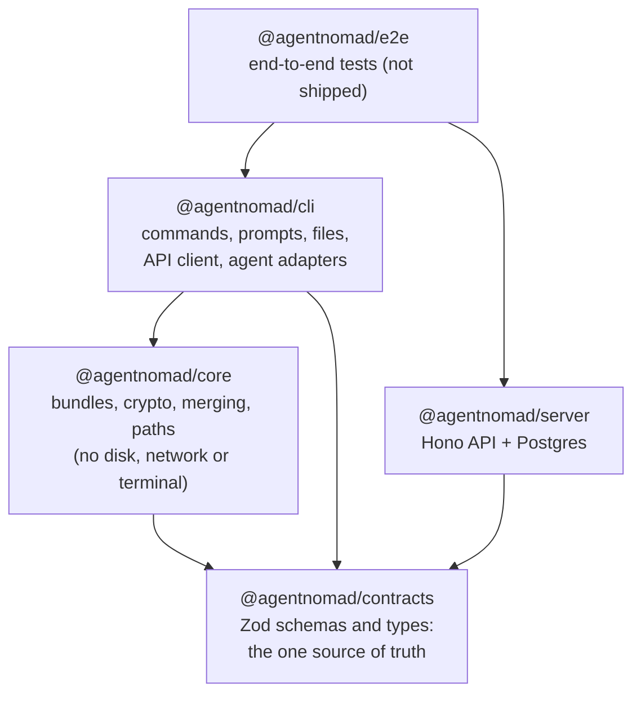
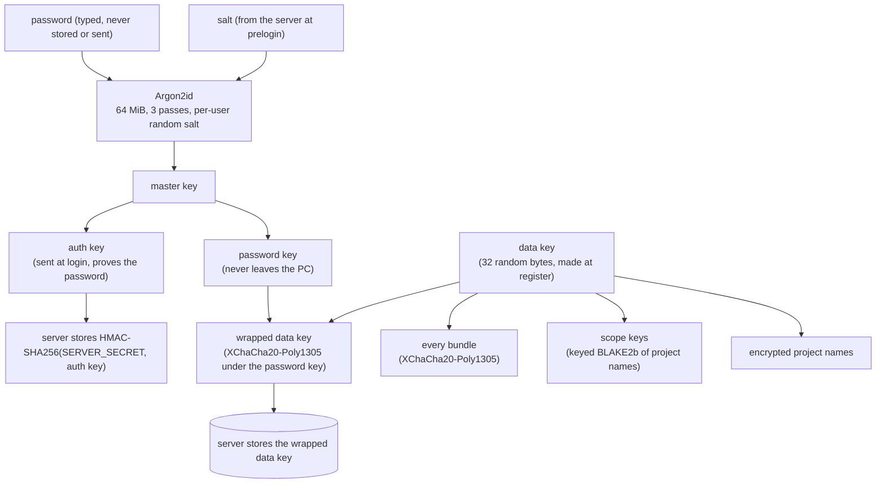
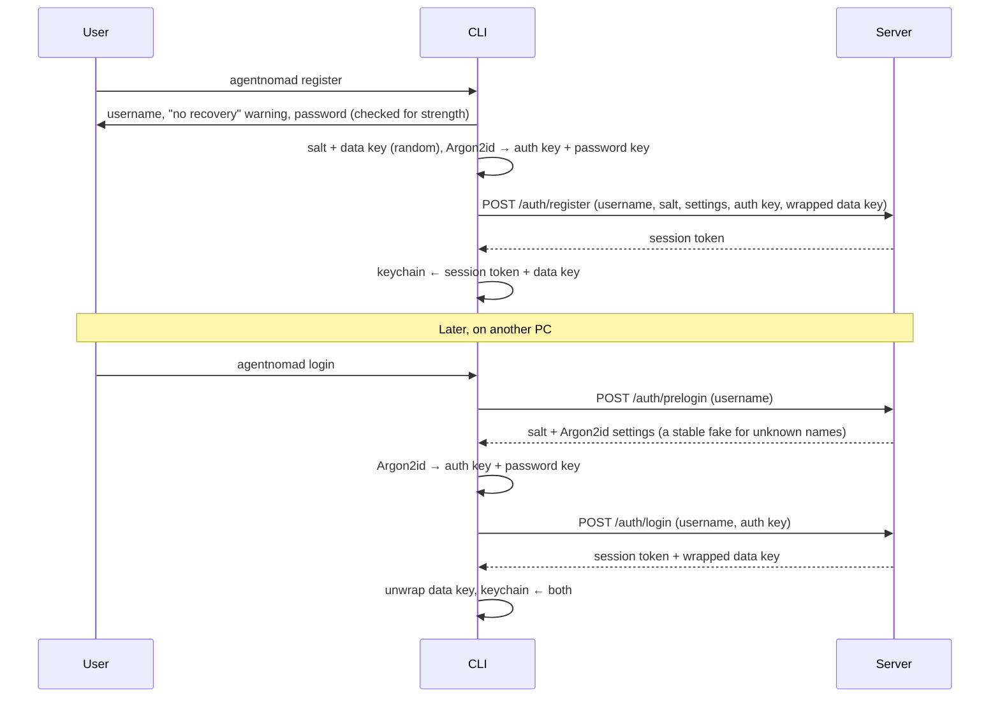
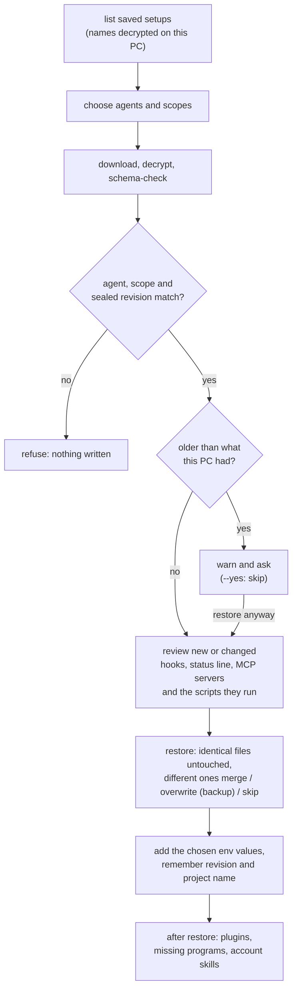

# Architecture

How agentnomad works, end to end, and what every file is responsible for.

- **Part 1** explains the system: the pieces, the keys, the bundle, what each command does,
  the server, and how it is tested.
- **Part 2** is a file-by-file reference.

New here? Read [The big picture](#1-the-big-picture), then [Push](#push) and [Pull](#pull). To add
an agent, see [ADDING-AN-AGENT.md](ADDING-AN-AGENT.md). Security details are in
[security/threat-model.md](security/threat-model.md).

## Contents

- [Part 1 · How the system works](#part-1--how-the-system-works)
  - [1. The big picture](#1-the-big-picture)
  - [2. Packages and how they depend on each other](#2-packages-and-how-they-depend-on-each-other)
  - [3. Keys and encryption](#3-keys-and-encryption)
  - [4. The bundle](#4-the-bundle)
  - [5. What each command does](#5-what-each-command-does)
  - [6. Agent adapters](#6-agent-adapters)
  - [7. The Claude Code adapter](#7-the-claude-code-adapter)
  - [8. The server](#8-the-server)
  - [9. What the CLI keeps on a PC](#9-what-the-cli-keeps-on-a-pc)
  - [10. Running from scripts and CI](#10-running-from-scripts-and-ci)
  - [11. Tests, CI and deployment](#11-tests-ci-and-deployment)
  - [12. Design rules](#12-design-rules)
- [Part 2 · File reference](#part-2--file-reference)

---

# Part 1 · How the system works

## 1. The big picture

agentnomad copies an AI coding agent's setup (settings, instructions, skills, subagents,
commands, hooks, MCP servers, plugins, optional memory) from one PC to another, through a
server that can never read it.

```mermaid
flowchart LR
  subgraph PCA["PC A (e.g. macOS)"]
    A1["~/.claude and project files"] --> A2["collect"]
    A2 --> A3["make paths portable<br/>({{HOME}})"]
    A3 --> A4["compress + encrypt<br/>(data key)"]
  end
  subgraph Server["agentnomad API (Render + Neon)"]
    S1[("bundles: ciphertext<br/>+ metadata only")]
  end
  subgraph PCB["PC B (e.g. Windows)"]
    B1["decrypt + decompress"] --> B2["check: agent, scope,<br/>revision"]
    B2 --> B3["review commands<br/>that run programs"]
    B3 --> B4["restore with this PC's<br/>paths, merge or overwrite"]
    B4 --> B5["reinstall plugins,<br/>offer programs, env values"]
  end
  A4 -- "HTTPS, ciphertext only" --> S1
  S1 -- "ciphertext" --> B1
```



The rules that shape everything else:

1. **Encryption happens on the PC.** The server stores ciphertext and a little metadata. It
   never sees a file, a project name, a password or a key that could open them.
2. **One password, any PC.** Logging in on a new PC with the same password unlocks
   everything; there is no password recovery, because recovery would mean the server could
   open the data.
3. **One bundle per agent and scope.** A "scope" is the agent's global setup, or one
   project. Each is saved, versioned and restored on its own.
4. **Agents are plug-ins.** Everything agent-specific lives in an adapter. Push, pull,
   encryption and the server do not know what Claude Code is.
5. **Nothing runs without being shown.** Anything restored that runs programs (hooks, the
   status line, MCP servers, the scripts they run, plugins, npm packages) is listed and
   asked about first.

## 2. Packages and how they depend on each other

A pnpm monorepo of five TypeScript packages (strict mode, ES modules, Node 22.13 or newer).



| Package     | Responsibility                                                                                                                                                                                                               | Talks to               |
| ----------- | ---------------------------------------------------------------------------------------------------------------------------------------------------------------------------------------------------------------------------- | ---------------------- |
| `contracts` | Every shape that crosses a boundary: API requests and responses, the bundle format, limits, error codes. Validated at runtime with Zod on both sides.                                                                        | nothing                |
| `core`      | Pure logic: key derivation, encryption envelopes, the bundle codec, project-name hashing, path portability, merge strategies. Takes everything it needs as arguments (OS, home folder), so every OS can be tested on any OS. | nothing (no Node APIs) |
| `cli`       | The `agentnomad` command. Reads and writes files, asks questions, keeps secrets in the OS keychain, calls the API, and holds the agent adapters.                                                                             | the API over HTTPS     |
| `server`    | The API: accounts, sessions, encrypted bundles, rate limits. Knows nothing about agents or files.                                                                                                                            | Postgres (Neon)        |
| `e2e`       | Runs the built CLI as a script against a local copy of the API, across operating systems.                                                                                                                                    | local only             |

The server and the CLI never import each other; they only share `contracts`. So a change to
the API shape is a change in one place, checked on both sides.

**Strict on what is sent, tolerant on what is received (T57).** The server deploys from
`main` within minutes; installed CLIs update when their users choose. So the server parses
requests with strict schemas (an unknown field is refused) and is typed against strict
answer schemas, while the CLI reads answers with `ClientAnswerSchemas` (`api/answers.ts`):
the same field definitions, but an unknown field is dropped instead of refused, and any
error code is accepted. A known code works as before; an unknown one becomes an `ApiError`
with code `unknown` that shows the server's message. A missing or wrongly typed known field
is still refused, and every bound stays (KDF settings, sizes, revisions). This only helps
CLIs released after 1.0.3: 1.0.3 and older still refuse any new field or code, so the server must
not send one until they are gone (`routes/bundles.ts` and `WRONG_PASSWORD_MESSAGE` work
around them today). Every request carries the CLI version in `x-an-client`, which the
server logs, so it can later tell old CLIs to update.

## 3. Keys and encryption



- **Register:** the CLI makes a random salt and a random **data key**, derives the master
  key from the password with Argon2id, splits it into an **auth key** and a **password
  key**, wraps the data key with the password key, and sends the username, salt, Argon2id
  settings, auth key and wrapped data key. The server stores a keyed hash of the auth key.
- **Login on any PC:** prelogin returns the salt and settings; the same password gives the
  same keys; the server checks the auth key and returns the wrapped data key, which only
  the password key can open. The data key and a session token are then kept in the OS
  keychain.
- **Why two keys:** changing the password only re-wraps the small data key; bundles never
  need re-encrypting.
- **Bundles** are sealed with XChaCha20-Poly1305 (a fresh random 24-byte nonce each time).
  The associated data binds the format version, the agent and the scope key, so a bundle
  served under another agent or scope fails to open.
- **Project names** never reach the server readable: the server sees a scope key (a keyed
  hash, the same on every PC) and an encrypted name only the user's PCs can read.
- **Key formats are versioned.** Labels such as `agentnomad/scope-key/v1` and the KDF
  context are part of the stored format and never change in place; a new scheme is added
  next to the old one.

The server has its own secret, `SERVER_SECRET`, which keys the auth-key hashes, the fake
salts returned for unknown usernames, and the pseudonyms in rate-limit rows. It lives only
in the host's settings, never in the database.

## 4. The bundle

A bundle is one agent's setup for one scope, as plain data before encryption:

| Field           | Meaning                                                                                                         |
| --------------- | --------------------------------------------------------------------------------------------------------------- |
| `formatVersion` | `1`. Readers refuse any other version.                                                                          |
| `agent`         | e.g. `claude-code`.                                                                                             |
| `scope`         | `{ kind: 'global' }` or `{ kind: 'project', name }`.                                                            |
| `sourceOs`      | `darwin`, `linux` or `win32`: where it was saved, to flag hooks that only run there.                            |
| `agentVersion`  | e.g. Claude Code `2.1.282`; pull warns when this PC runs an older one.                                          |
| `revision`      | The revision this copy is saved as, sealed inside so a server cannot pass an older copy off as the current one. |
| `files`         | Every file: a relative forward-slash path, `executable`, and content as UTF-8 text or base64.                   |

**Portable paths.** In text files, the user's home folder is replaced by `{{HOME}}` on push
(a `{{HOME}}` already written in a file is stored as `{{HOME\}}` and comes back unchanged)
and by the other PC's home on pull (with backslashes in `.bat` and `.cmd` files on Windows), so `C:\Users\ana\.claude\hooks\check.sh` in a hook
becomes `/Users/ana/.claude/hooks/check.sh` on a Mac. Paths inside the bundle are relative
to the agent's base folder (global) or the project root (project), never absolute and never
with `..`.

**Reserved entries.** Things that are not plain files of the agent's folder live under
`.agentnomad/` in the bundle (`RESERVED_DIR` in `agents/adapter.ts`, one name for every
agent and the generic code):

| Entry                              | What it holds                                                                                                                                                        | On pull                                                                                                                                                                                                       |
| ---------------------------------- | -------------------------------------------------------------------------------------------------------------------------------------------------------------------- | ------------------------------------------------------------------------------------------------------------------------------------------------------------------------------------------------------------- |
| `.agentnomad/claude.json`          | Selected `~/.claude.json` keys: MCP servers and documented preferences                                                                                               | Merged in by key; the file's login and project state are never touched                                                                                                                                        |
| `.agentnomad/home/...`             | Scripts the hooks or status line run from elsewhere in the home folder, and known tool settings                                                                      | Written back to the home folder: scripts only if the setup's own hooks or status line run them, known tool settings always                                                                                    |
| `.agentnomad/auto-memory/...`      | The project's auto memory (opt-in)                                                                                                                                   | Written to this PC's memory folder for the project                                                                                                                                                            |
| `.agentnomad/plugins.json`         | Installed plugins and their marketplaces                                                                                                                             | Plugins are reinstalled with `claude plugin`, never copied                                                                                                                                                    |
| `.agentnomad/plugin-versions.json` | The installed version of each saved plugin (T100); left out when none is known                                                                                       | Claude Code installs the latest version; pull names each plugin whose version changed (`was X, now Y`). Older CLIs refuse it with one warning and go on                                                       |
| `.agentnomad/programs.json`        | Programs hooks start, and how npm installed them                                                                                                                     | Missing ones are offered for install                                                                                                                                                                          |
| `.agentnomad/env.json`             | Environment variable values the user chose to save                                                                                                                   | Offered for the shell profile; never written as a file                                                                                                                                                        |
| `.agentnomad/account-skills/...`   | A copy of the user's own claude.ai skills (opt-in; never Anthropic's or an organization's)                                                                           | Offered as local skills in `~/.claude/skills/<name>/`, only on a PC that does not already get them from claude.ai                                                                                             |
| `.agentnomad/account-plugins/...`  | A copy of the plugin folders of the user's own claude.ai uploads (opt-in, T101; never claude.ai's directory, an organization's, or one claude.ai installs by itself) | Offered as plugins in `~/.claude/skills/<name>/` (`<name>@skills-dir`) after the plugin review, only on a PC that does not already get them from claude.ai. Older CLIs refuse them with one warning and go on |

**From bundle to bytes:** JSON → gzip → XChaCha20-Poly1305 → upload. The encrypted size is
capped at 5 MB; decompression stops at 64 MB (a guard against decompression bombs); the
result is schema-checked before anything is written.

## 5. What each command does

### Register and login



`logout` ends the session on the server and always forgets it on the PC, even offline. When
the server answers but does not end it (a rate limit, a server error), the warning gives the
server's reason instead of "Could not reach the server".

A login or register on a PC that already holds a login asks first (`--yes` answers yes), then
keeps the current login until the new one works: only when the new session and data key are
in hand is the old session ended and the new one saved (UX-01). A wrong password, a taken
username, a "no" or Ctrl+C before that leaves the current login as it was.

When login succeeds on the server but the data key does not unwrap with this password, the
new session is never saved on the PC: login sends `POST /auth/logout` once with that session's
own token from the login answer (not the keychain), then shows "Logged in, but your data key
could not be unlocked with this password." Best effort (T66): a failed or timed-out logout is
not retried and never replaces that error; the session then ends by itself on the server.

### Push

1. Detect installed agents; choose agents and scopes (or take `--agent`, `--global`,
   `--project`).
2. A project is named once per folder (remembered in local state). The home folder and the
   agent's own folder (`~/.claude`) are never a project, in push or pull: their `.claude/` is
   the global setup. They are not offered, and `--project` there stops with a message to run
   the command from the project's folder (`cli/project-folder.ts`).
3. Choose whether to include memory (`--memory` / `--no-memory`).
4. Show organization-managed settings and files the adapter does not know yet.
5. The adapter **collects** the files; the user may add saved environment values. Links
   into folders for keys, links out of a project and files over 10 MB are left out, and push
   says so.
6. Compare each setup's revision on the server with the one this PC last knew. If another
   PC saved a newer copy (or deleted it), the user is asked whether to replace it (with
   `--yes`: never). If this PC's last pull of a setup did not restore everything (declined
   commands, or differing files it left as they were), pushing it could drop them for every
   PC: push asks first, and `--yes` skips it with a note.
7. Paths are made portable, the bundle is built, compressed and **encrypted for the exact
   revision it will become** (the one on the server, plus one).
8. Upload with that expected revision, and remember the new revision for this PC. If another
   PC saved in the meantime, the server refuses (`revision_conflict`) and the setup is
   skipped, never replaced unasked.

Push is split in two (T59): a **plan** step does steps 1 to 6 and asks every question, and an
**apply** step does 7 and 8. The apply step is given no prompter at all, so it cannot ask.

### Pull



Pull is split like push (T59). The **plan** step lists, downloads and checks every chosen
setup and asks every question before anything is written: an older copy, new commands, each
file here that differs (`~/.claude.json` whenever the setup has it) and missing environment
values, then each agent's own questions (T61): for Claude Code, closing Claude Code when
`~/.claude.json` would change, then saved claude.ai plugins and the plugin folders in
`skills/`, then plugins, programs and claude.ai skills. Without a
terminal, an open question stops pull here, before any file changes. The **apply** step
writes with those answers and has no prompter, nor does the agent's follow-up it runs last
(plugin and program installs, adding the skills); a file only the restorer finds different,
which the plan never asked about, is left as it is and the setup counts as not done.

- Files that only differ in how the home path is written (`C:/` vs `C:\`) are left as they
  are.
- Pull never deletes files.
- `--merge` and `--overwrite` answer every file at once; JSON merges by key (the incoming
  side wins), other text files are kept and the incoming copy is saved next to them. A JSON
  file holding a number JSON cannot keep (past the safe integer range, or too large for a
  double, such as `1e400`) is kept side by side too.
- `--yes` never accepts new commands, plugin reinstalls or npm installs; `--allow-commands`
  does.

### The other commands

| Command          | What it does                                                                                                                                                                    |
| ---------------- | ------------------------------------------------------------------------------------------------------------------------------------------------------------------------------- |
| `list`           | Every saved setup, grouped by agent, with revision, size and age. Project names are decrypted on this PC.                                                                       |
| `status`         | For each saved setup: up to date, newer on the server, never pulled here, or deleted on the server. Uses only the revisions this PC remembers; downloads nothing.               |
| `delete`         | Deletes saved setups from the server after confirming; files on the PC are untouched.                                                                                           |
| `account delete` | Deletes the account and every setup. Always needs the username and the password (the server checks the auth key), so a stolen session cannot do it.                             |
| `agents`         | Supported agents, whether each is installed here, its version and folder, and organization-managed settings.                                                                    |
| `env`            | Which environment variables this PC's setups use and whether each is set here (the home folder and the agent's own folder count as the global setup only). Never shows a value. |

## 6. Agent adapters

Everything agent-specific sits behind one interface, `AgentAdapter`
(`packages/cli/src/agents/adapter.ts`):

| Part                           | Question it answers                                                                                                                                                                                                                                                                                                    |
| ------------------------------ | ---------------------------------------------------------------------------------------------------------------------------------------------------------------------------------------------------------------------------------------------------------------------------------------------------------------------- |
| `detector`                     | Is the agent installed here? Where is its base folder? Which version?                                                                                                                                                                                                                                                  |
| `collector`                    | Which files make up the global setup, or a project's setup? (Never credentials or machine state.)                                                                                                                                                                                                                      |
| `restorer`                     | Write a pulled setup back: where each file goes, what is refused, per-OS line endings and permissions, conflicts. Also what pull's plan must ask first: what runs programs (`reviewRunnable`), which files differ (`conflicts`), which saved variables redirect requests (`isRedirectVariable`). It never asks itself. |
| `inspector` (optional)         | What should the user be told on push, pull or `agents` (managed settings, files this version does not know yet, a setup saved with a newer version)? What push's summary adds about the collected files (`pushNotes`, T97: the plugins in `skills/`)?                                                                  |
| `optionalParts` (optional)     | What push saves only after a yes, e.g. Claude Code's claude.ai skills; `available()` may add a `notice` push shows before asking; `--<id>` / `--no-<id>` answer it in push and pull, built from the registered adapters with the part's `flagHelp`.                                                                    |
| `envReferences` (optional)     | Which files can use `${VAR}` (MCP servers, settings) and which variables the agent sets itself; push offers the values, `agentnomad env` lists them.                                                                                                                                                                   |
| `memoryDescription` (optional) | What push's memory question names.                                                                                                                                                                                                                                                                                     |
| `planRestore` (optional)       | The agent's own questions in pull's plan step; returns how to write the setup and a follow-up (e.g. plugin reinstalls) that gets no prompter. The plan may say it left part of the setup out (`declined`, T97), so a later push asks first, as after declined commands.                                                |

Adapters are registered in one place, `createAppRegistry` in `packages/cli/src/app.ts`,
through `createAgentRegistry`. Push, pull, `list`, `status`, `delete` and `agents` only use
the registry and these interfaces, so a new agent is a new folder plus one line there. See
[ADDING-AN-AGENT.md](ADDING-AN-AGENT.md). A lint rule (`no-restricted-imports` in
`eslint.config.js`) keeps every generic folder (`push/`, `pull/`, `cli/`, `env/`, `commands/` and the
folders they build on, such as `api/`, `state/` and `ui/`) from importing any adapter's
folder and an adapter's folder from importing another's (what adapters share is in
`agents/shared/`), and `test/agent-boundary.test.ts` runs a second, made-up agent through push and pull (T61).

Data is stored per agent (`agent` is part of every bundle's key), so adding an agent never
touches anyone's existing saves.

## 7. The Claude Code adapter

Base folder: `~/.claude`, or `CLAUDE_CONFIG_DIR` when set.

**Detection.** Installed when the `claude` command is found (PATH, PATHEXT on Windows,
`~/.local/bin` from the native installer) or the base folder exists. The version comes from
`claude --version` (no shell, 5-second limit).

**What is saved.** Every list lives in one data file,
`claude-code-paths.data.ts`, checked against a schema when loaded, so a new Claude Code
file is a one-line change there:

| Scope               | Saved                                                                                                                                                                                                             | Never saved                                                                                                                                                                                                      |
| ------------------- | ----------------------------------------------------------------------------------------------------------------------------------------------------------------------------------------------------------------- | ---------------------------------------------------------------------------------------------------------------------------------------------------------------------------------------------------------------- |
| Global `~/.claude/` | `settings.json`, `CLAUDE.md`, `keybindings.json`, `rules/`, `skills/` (plugins and mods there too, T97), `commands/`, `agents/`, `workflows/`, `output-styles/`, `themes/`, scripts hooks and the status line run | `.credentials.json`, history, transcripts, sessions, caches, backups, plugin caches, `settings.local.json`, `skills/synced/` (synced by claude.ai), `.claude-plugin/types/` in a plugin in `skills/` (generated) |
| `~/.claude.json`    | Only `mcpServers` and documented preference keys                                                                                                                                                                  | Login, projects, usage and onboarding state                                                                                                                                                                      |
| Project root        | `CLAUDE.md`, `CLAUDE.local.md`, `AGENTS.md`, `.mcp.json`, `.worktreeinclude`, scripts the project's hooks run                                                                                                     | Everything else, including app code, `.env` and `.git`                                                                                                                                                           |
| Project `.claude/`  | `settings.json`, `settings.local.json`, `CLAUDE.md`, and the global folders except `themes/`                                                                                                                      | `agent-memory-local/`, `worktrees/`                                                                                                                                                                              |
| Opt-in              | Subagent memory, auto memory                                                                                                                                                                                      |                                                                                                                                                                                                                  |

The scripts hooks and the status line run are found in the words each program gets
(`settings-commands.ts`, one reading for push, pull and the review): a hook in exec form
(`args` set) passes each `args` element as one word, spaces and all; a shell-form command is
split like a shell, and a word that carries a command line (`bash -c "a.sh; true"`,
`pwsh -Command "& 'a.ps1'"`) is split again, at any depth, also on shell operators (`a.sh;`,
`a.sh&&b`). The review shows an exec-form hook with each `args` element quoted and compares
it by its words, so a text moved between one argument and a shell command line is shown as
new. The "will likely not run here" warning for a setup from another OS looks only at a
command's program and the scripts it runs, and shows the command as written, with line breaks
escaped.

**Restore rules** (`restore-rules.ts`): a file is written only if a collector could have
produced it. A home-folder file must be a known tool's settings or a script the setup's
own hooks or status line run, and never in a folder whose files run by themselves (Startup,
`.config/autostart`, `Library/LaunchAgents`, fish and PowerShell profile folders), so a
bundle cannot drop a file that runs by itself. The same holds in Claude Code's own folder: a
script outside the synced folders is written only when the setup's hooks or status line run
it, and never in Claude Code's own state (`knownState`: `chrome/`, `local/`, `state/`, …),
which is refused like never-synced entries (T55). What Claude Code generates inside a plugin in
`skills/` (`.claude-plugin/types/`, from `plugins.generatedInPlugin`) is never pushed and
refused on pull (T97). Refusals ignore case. On Windows, names with
`:`, device names, trailing dots and 8.3 short names (`PROGRA~1`; a name too long for the
8.3 form, like `release-notes~3.md`, is allowed) are refused. Two entries that differ
only in case or Unicode form are one file on Windows and macOS: only the first is written. An
entry that cannot be written is skipped with a warning; the rest continue. `~/.claude.json`
is only ever merged, with a backup: only `mcpServers` and the preference keys, never
`projects` or account state. It is skipped while Claude Code is running (it rewrites the file
while open): pull's plan step asks to close it ("I closed it, continue" checks again,
"Skip ~/.claude.json this time" leaves it with a warning; `--yes` never waits), and the
restorer checks once more right before writing and leaves the file if it is open again. It is
read again at that point, as Claude Code saves it while closing. Running means a `claude` program
(also under a folder with a space; npm's package now ships it as a native `claude.exe`, checked
with a real install on Windows), an interpreter or launcher such as `node`, `bun`, `sh` or `env`
running Claude Code's script (npm's fallback, as `node /usr/local/bin/claude`; an argument
naming them does not count; command lines on Windows are read through PowerShell, else
`tasklist` names), or the Claude app, whose Code tab runs Claude Code and shares
`~/.claude.json`. Auto memory is Markdown only, and
a folder chosen by the project's `autoMemoryDirectory` is used only inside the home folder
and outside refused folders (`auto-memory.ts`).

**Review of runnable things** (`command-review.ts`): everything Claude Code's docs say it
runs, when new or changed compared with this PC, is listed before anything is written: hooks
(commands, and `http` hooks that send data to an address), the status line, settings that
run a command (`apiKeyHelper`, `awsAuthRefresh`, `awsCredentialExport`, `gcpAuthRefresh`,
`otelHeadersHelper`, `fileSuggestion`), loader variables in a settings `env` block
(`NODE_OPTIONS`, `LD_PRELOAD`, …) and `env` names that redirect Claude Code
(`ANTHROPIC_BASE_URL` and the other endpoints, proxies, `NODE_EXTRA_CA_CERTS`, its shell
variables, OpenTelemetry endpoints, `PATH`), a `permissions.defaultMode` that lets Claude act
without asking (`bypassPermissions` and `auto` in global settings, where alone Claude Code
takes them; `acceptEdits` from any settings file),
`permissions.allow` rules and `permissions.additionalDirectories` new on this PC, a new or
changed `sandbox` block, `enableAllProjectMcpServers`, MCP servers (the whole definition is
compared, so a new `env` or `headersHelper` shows), files that commands here or in the bundle
run (matched by path, also inside a quoted command line or next to shell punctuation; any
file that can run: a script extension, no extension, the executable bit or a `#!` line) and the scripts next to them, known tool settings (ccstatusline), and skill, command and subagent files with
commands that run by themselves (`runnable-markdown.ts`: a `` !`command` `` placeholder, a
` ```! ` block at any indentation, as in a list item, or inside another open block, since
the docs do not say Claude Code skips it there; frontmatter `hooks`; a fence closes only on
the same character, at least as long). Commands written as instructions are never flagged. Hooks and MCP servers are read
one by one: one that cannot be read is shown as unreadable (its JSON), never left out, and
hides no other.
The keys and names come from `reviewed-settings.ts`, each checked against Claude Code's
settings reference. Declining skips the files that hold them. Saved environment values that make programs load
code, or send programs' requests elsewhere (the redirect names above, such as `HTTPS_PROXY`
and `ANTHROPIC_BASE_URL`), need their own yes, and `--yes` alone never adds them. A saved
value already in agentnomad's block of the shell profile (on Windows: a user variable with
that value) counts as set, even in a terminal opened before it was added, so pulling again
asks nothing; a block that would not change is neither backed up nor written (T56). Everything printed from a bundle
or the server goes through `printable`, so escape sequences are shown, never acted on; the
label and command of each review entry go through `printableLine`, which also shows line
breaks and tabs as `\u{…}`, so a command cannot add lines that look like more entries (SEC-03).

**Plugins and mods in `skills/` (T97):** a folder in `~/.claude/skills/` with
`.claude-plugin/plugin.json` is a plugin Claude Code loads as `<name>@skills-dir`; with
`hooks/hooks.json` (a mod's `modules`, or classic command hooks) it runs code inside Claude
Code. Push takes it with `skills/`, minus `.claude-plugin/types/`, and its summary names it
(`Plugins in skills/: probe-mod@skills-dir (runs code)`). Pull's plan step reviews each one
that is new or changed here before anything is written (`plugin-review.ts`, global setup
only): it writes the folder's files into a new temporary folder of its own (never a path
read from the bundle) and runs `claude plugin validate --json` there, with an empty
`CLAUDE_CONFIG_DIR` of its own, since Claude Code rewrites settings when it starts. It shows
each module's `hooks:` and `calls:` lines, flags `$.process`, `$.fs` writes, `$.model` and
network calls (and offers the module's source), and lists classic command hooks with the
same hook reader as settings. A folder with code needs a yes or `--allow-commands`; `--yes`
alone never writes it. A folder validate fails (exit 1) shows its errors and is written only
after a person's yes, never by a flag. Without Claude Code or without `claude plugin
validate`, pull says so and treats the folder as unreviewed code. A declined folder is left
out whole and the setup is noted as partial, so a later push asks first. T98, T99 and T101
use the same review.

**claude.ai skills (T42, opt-in):** Claude Code downloads the skills of the user's claude.ai
account into `skills/synced/<account>/` and manages that folder; agentnomad never writes
there. `push --account-skills` saves a copy of the user's **own** ones under
`.agentnomad/account-skills/`. The folder's `manifest.json` tells them apart: before
Claude Code 2.1.295 by `creatorType: user`; from 2.1.295, which writes no `creatorType`, by
`source` `custom` or `plugin`. A `plugin` skill is the user's only when its backing plugin
(`backingPluginId`, found in `plugins/synced/<account>/manifest.json`) comes from a
marketplace of scope `account` in `.marketplaces.json`; `org` and `default` (an
organization's, claude.ai's directory) are left out and named. Without `.marketplaces.json`
an organization's skill cannot be told apart, and push says so; with it, a skill whose
marketplace cannot be found, or with a `source` agentnomad does not know, is left out and
named. Anthropic's (`anthropic`, `anthropic-example`) and `session-refs` are never saved.
On pull they are listed and, after a yes (or `--account-skills`), written as normal local
skills in `~/.claude/skills/<name>/`, skipping any this PC already gets from claude.ai and
never replacing a local skill. A local skill runs its `!`command`` lines where a synced one
does not, so such skills are marked, and a flag alone adds them only with
`--allow-commands`.

**claude.ai plugins (T101, opt-in):** the same rules for the plugins Claude Code syncs into
`plugins/synced/<account>/`, which agentnomad never writes either. `push --account-plugins`
saves a copy of the user's **own** ones under `.agentnomad/account-plugins/<name>/`: only a
plugin whose marketplace has scope `account` in `.marketplaces.json` (My Uploads), never
`default` (claude.ai's directory, e.g. Anthropic's knowledge-work plugins) or `org`, and never
one with `installationPreference` `required` or `auto_install` (claude.ai installs those by
itself). A manifest or marketplaces list in an unknown shape saves nothing for that account,
and push says why; without `.marketplaces.json` nothing is saved and push says so; a plugin
whose marketplace is not listed, or whose folder has no `.claude-plugin/plugin.json`, is left
out and named. "The plugin's files" are the folder named after the plugin next to the
manifest, `plugins/synced/<account>/<name>/`, taken whole minus the skipped names and what
Claude Code generates in a plugin (`.claude-plugin/types/`); the `<name>.meta.json` beside it
only repeats manifest fields and stays. On pull they are listed and, after a yes (or
`--account-plugins`; `--yes` alone never), added to the setup as `skills/<name>/`, where
Claude Code loads them as `<name>@skills-dir`, skipping one this PC already gets from
claude.ai (a synced plugin or skill of that name) and any name a local skill or plugin uses.
They then go through the plugin review above like any plugin folder. If the PC later signs in
to the account they came from, Claude Code prefers the local copy.

**After restore:** plugins are reinstalled with Claude Code's own `claude plugin
marketplace add` and `claude plugin install` (on Windows a `.cmd` launcher runs through
`cmd.exe` with one verbatim line: an argument with a space, like a local marketplace folder,
is quoted; one with `"&|<>^%!`, other white space or control characters is refused); a
plugin built by running a command gets its own question; programs that hooks start and npm installed are offered with
`npm install -g name@version` (the package is the one the launcher runs: its link on macOS
and Linux, its `.cmd` on Windows, so `tsc` from `typescript` and scoped packages count).

**Claude Code plugin facts (2.1.295)** (T96), seen on a real Claude Code for the plugin and
mod sync tasks; the test fixtures in `claude-code-plugin-fixtures.ts` hold each one:

- A mod (`hooks/hooks.json` naming modules) in `~/.claude/skills/<name>/` loads as
  `<name>@skills-dir`, scope user.
- A plugin's data folder is `plugins/data/<id>` with every character other than letters,
  digits, `_`, `*` and `-` turned into `-` (`Odd.Name_v2@my-local.mkt` →
  `Odd-Name_v2-my-local-mkt`). A mod's `$.store` is not there but in
  `plugins/store/<safe id>-<first 12 hex of sha256(id)>.json`, the folder mode 700 and the file
  600 (`probe-mod@skills-dir` → `probe-mod_skills-dir-e89169932969.json`).
- `skills/synced/<account>/manifest.json` entries have no `creatorType` any more; `source` is
  `anthropic`, `anthropic-example`, `plugin` (the user's uploads, with a `backingPluginId`),
  `custom` or `session-refs`. `plugins/synced/<account>/manifest.json` entries carry an
  `installationPreference` (`available`, `required`, `auto_install`, `not_available`) and
  `.marketplaces.json` rows a `scope` (`org`, `default`, `account` for My Uploads).
- `claude plugin validate` prints one `hooks:` and one `calls:` line per module (`calls:` names
  only `$` methods; classic command hooks are not listed), exits 0 on a pass, also with
  warnings, and 1 on an error (a syntax error, a missing module, a broken manifest);
  `--strict` makes a warning fail. `--json` has the same lines in each entry's `notes`
  (checked again on 2.1.296).
- `policy-limits.json.stamp.json` is state and never synced.
- Assumed, not seen on a real account (T101): the plugins manifest wraps its entries in a
  `plugins` list, `.marketplaces.json` is a plain list in `plugins/synced/<account>/`, each
  synced plugin's files are in `plugins/synced/<account>/<name>/` with a
  `.claude-plugin/plugin.json`, and `presentsAs` and `generation` are absent. Anything else
  makes push save nothing for that account and say why.
- A mod's `hooks/hooks.json` is `{"modules": ["./register.ts"]}`; module paths are read from
  the `hooks/` folder (`hooks/register.ts`). A module exports `register(on, options)` and each
  hook takes `$` first (`on("session.start", async ($, e) => …)`); a module that calls no `$`
  method is listed as `calls: nothing on $`. A module error is an entry error named
  `modules../register.ts` (checked on 2.1.296, T97).
- Running `claude` rewrites the settings of the config folder it uses (2.1.296 turned
  `"model": "opus"` into `"opus[1m]"`), so pull runs validate with an empty
  `CLAUDE_CONFIG_DIR` of its own (T97).
- Claude Code 2.1.296 cannot install a chosen version of a plugin (T100): `claude plugin
install` has no version option, and `name@marketplace@1.0.0` installs the marketplace's
  current version all the same (the `@1.0.0` is ignored, exit 0). A marketplace `#ref`
  (saved in `plugins.json` when the user added it so) fixes the whole catalog, not one
  plugin, and a version or sha in a marketplace entry is the marketplace author's choice.
  `installed_plugins.json` records each install's `version`: the manifest's, else the
  entry's, else a 12-character commit or digest, `unknown` for npm and local folders. So
  push saves the versions in `plugin-versions.json`, and pull installs the latest and names
  each change.

**Keeping up with Claude Code:** files Claude Code adds that the data file does not know
are reported on push (a folder holding a script the hooks or status line run is not: push saves
that script); the Claude Code version is stamped in every bundle; and a weekly
drift check (`.github/workflows/drift-check.yml`) compares the data file with the newest
Claude Code. It reads the official
[.claude directory docs](https://code.claude.com/docs/en/claude-directory), runs a fresh
Claude Code in an empty folder to see what it creates, and collects the changelog entries
about files and setup, or naming a settings key the pull review watches
(`reviewed-settings.ts`), since the data file's `reviewedVersion`. Anything new goes into one
open GitHub issue labelled `drift`; the fresh install runs with no write permissions.

## 8. The server

A [Hono](https://hono.dev) app on Node, deployed on Render from `main`, with Neon Postgres
through Drizzle.

| Route                              | Needs              | Does                                                                              |
| ---------------------------------- | ------------------ | --------------------------------------------------------------------------------- |
| `GET /health`                      | –                  | Liveness (also wakes the free host).                                              |
| `POST /auth/prelogin`              | –                  | Salt and Argon2id settings; a stable fake for unknown names.                      |
| `POST /auth/register`              | –                  | Creates the account and a session.                                                |
| `POST /auth/login`                 | –                  | Checks the auth key; returns a session and the wrapped data key.                  |
| `POST /auth/logout`                | session            | Ends this session.                                                                |
| `GET /bundles`                     | session            | This user's saved setups (metadata only), newest first, cursor-paginated.         |
| `GET /bundles/:agent/:scopeKey`    | session            | The encrypted bytes, with revision and SHA-256 in headers.                        |
| `PUT /bundles/:agent/:scopeKey`    | session            | Saves a new revision if `expectedRevision` matches; else `409 revision_conflict`. |
| `DELETE /bundles/:agent/:scopeKey` | session            | Deletes one saved setup.                                                          |
| `DELETE /account`                  | session + auth key | Deletes the account; sessions, setups and files go with it.                       |

**Layers:** routes (validation with the contracts, errors, limits) → services
(`auth-service`, `bundle-service`: the rules, free of HTTP) → repositories and the blob
store (Postgres). `createApi` (`api.ts`) wires them from a database and is the only wiring:
production, the server tests and the e2e local server all use it. `server.ts` reads the
environment settings, opens the Neon pool and calls it; it refuses to start if
`DATABASE_URL` or `SERVER_SECRET` is missing or weak.

**Tables:** `users`, `sessions` (token hashes only), `bundles` (metadata: agent, scope key,
encrypted name, revision, size, hash, pointer to the current file), `bundle_blobs`
(ciphertext, a random id per upload), `rate_limits` (fixed-window counters, keyed by
pseudonyms). Keeping bytes apart from metadata means `list` never reads ciphertext. A new
upload is stored first, then the revision check switches the pointer, then the old file is
deleted, so two PCs saving at once can never overwrite or delete each other's file.

**Limits and logs:** 30 auth requests per minute per IP, 5 registrations per hour per IP
(an IPv6 address counts by its /64), 10 failed logins per account and 10 wrong-password
account deletes per account per 15 minutes (counted before the check, so parallel guesses
cannot slip past), 120 saves and deletes and 600 downloads per account per hour (the list of
setups has no limit); `429` with `Retry-After`.
Each account keeps at most 100 setups and 50 MB of encrypted bytes (checked before storing
anything and again inside the save's transaction, with the user row locked, both with one
rule, `storageLimitPassed`); over it,
`413 payload_too_large` says which limit. The visitor's IP is Cloudflare's
`CF-Connecting-IP` (`True-Client-IP` when that is missing). About one save in 50 also deletes
files no setup points to that are over an hour old, and about one rate-limited request in 100 prunes old counters and every user's expired sessions; a failed sweep or prune is logged and never fails the request. Register writes the account and its first session in one transaction. Logs are one JSON line per request with
a request id and the CLI version from `x-an-client` (`invalid` when it does not look like a
version; absent for 1.0.3 and older), never other headers, bodies or query strings; a failed query logs its SQL text, never
its parameters. There are no CORS headers and no cookies.

## 9. What the CLI keeps on a PC

| What                         | Where                                                                                                                                                             | Why                                                                                                                                                                                                                                                                                                                                                                                                                                                                     |
| ---------------------------- | ----------------------------------------------------------------------------------------------------------------------------------------------------------------- | ----------------------------------------------------------------------------------------------------------------------------------------------------------------------------------------------------------------------------------------------------------------------------------------------------------------------------------------------------------------------------------------------------------------------------------------------------------------------- |
| Session token and data key   | OS keychain: Windows Credential Manager, macOS Keychain, Linux Secret Service. Service `agentnomad`, account `<secret>@<server host>`                             | So later commands work without the password; one entry per server                                                                                                                                                                                                                                                                                                                                                                                                       |
| The same, without a keychain | `%APPDATA%\agentnomad\secrets.json` or `~/.config/agentnomad/secrets.json`, readable only by the user (600 in a 700 folder; on Windows an ACL for this user only) | Servers, WSL, SSH sessions; the CLI says when it is used. A login saved there while the keychain failed is moved into it once it works again, also over an older login still in the keychain, whose session is then ended (BUG-04)                                                                                                                                                                                                                                      |
| Local state                  | `state.json` in the same folder                                                                                                                                   | Which name each project folder was saved under, and the last revision this PC pushed or pulled of each setup (for conflicts, `status` and rollback checks), and the account those revisions belong to: a login or register as another account clears them and keeps the project names (T56). Only a missing file counts as empty; one that cannot be read stops the command. Two commands running at once are not serialized: the last write wins (rare, so not locked) |

`AGENTNOMAD_API_URL` points the CLI at another server (https, or http for localhost).

## 10. Running from scripts and CI

When stdin or stdout is not a terminal, the CLI swaps its prompter for one that never asks:
any question the flags leave open stops the command with exit code 1 and names the flags to
add. Push and pull ask every question in their plan step, before they change anything: pull
downloads and reviews every setup and asks about files that differ and missing environment
values first; push collects every setup and compares revisions with the server first. Every
command can be scripted:

```sh
echo "$PASSWORD" | agentnomad login --username me --password-stdin
agentnomad push --global --project my-app --memory --yes
agentnomad pull --global --yes --allow-commands
```

Exit codes: `0` done, `1` failed or an answer was needed, `130` cancelled. Warnings and
errors go to stderr. Passwords are read only from stdin, never from an argument.

Push and pull also exit with `1` when any setup was **not done**: skipped or refused without
the user answering no themselves. That is a newer copy on the server or one deleted there
(push), a setup whose last pull did not restore everything (push), a setup over the 5 MB limit
(push), an older copy than this PC had (pull), and a file that differs but was never asked
about (pull). Every other setup is still saved or restored first, then one message lists what
was not done. A setup the user skipped by answering a question with no is their choice and
exits with `0`; the same skip made by `--yes` exits with `1`. Parts of a setup that are left
out on purpose (declined commands, `~/.claude.json` while Claude Code runs) do not change the
exit code; they are warned about.

## 11. Tests, CI and deployment

| Layer                | What it covers                                                                                                                                                                                                                                                                                      | Where                      |
| -------------------- | --------------------------------------------------------------------------------------------------------------------------------------------------------------------------------------------------------------------------------------------------------------------------------------------------- | -------------------------- |
| Unit and integration | Every package: schemas, crypto vectors, codec limits, path portability on every OS, merge strategies, adapters against real temp folders, commands with fake servers, the API against PGlite                                                                                                        | `packages/*/test` (Vitest) |
| End to end           | The built CLI, run with no terminal, against the real API code on a local PGlite database: three PCs in sequence (register and push; pull with merge, edit, push; pull with overwrite, stale PC, delete, account delete). Every request is recorded and checked: nothing readable may leave the PC. | `packages/e2e`             |
| Cross-OS             | The same three steps on different machines, the database handed over as an artifact: macOS → Windows → macOS and Linux → Windows → Linux                                                                                                                                                            | `.github/workflows/ci.yml` |

CI runs `pnpm check` (typecheck, lint, format, tests) on macOS, Linux and Windows with
Node 22.13 and 24, the real OS keychain on every OS (the test runs only where
`AGENTNOMAD_TEST_REAL_KEYCHAIN=1`, so `pnpm test` on a developer's PC leaves the keychain
alone), the real Linux keychain (GNOME Keyring), and the two cross-OS chains,
each chain in its own jobs, so a failure in one does not skip the other's later steps.
On every OS and Node version it also builds the npm package, installs it globally, and runs
the e2e steps with the installed `agentnomad` command. One job (Linux, Node 24) also runs
`pnpm audit --prod` (known advisories in the packages users install) and
`pnpm --filter @agentnomad/server db:check` (`drizzle-kit check`: the migrations agree with
each other; offline, no database or secret). `.github/workflows/audit.yml` runs the same
audit every Wednesday, so a new advisory is noticed without a push. The same job runs
`pnpm knip` (unused files, dependencies and exports, set up in `knip.json`;
`includeEntryExports` is on, so an export only re-exported by an `index.ts` and used nowhere
is still reported), and any finding fails the build (T65): a name used only in its own file
is not exported, and the few exports kept for other code to use are tagged `@public` in their
JSDoc (the adapter interface `AgentInspector`, the crypto interfaces `PasswordKdf` and
`RandomSource`, and two wire types in `contracts`). In that job the tests run once, with
coverage, in place of `pnpm check`'s plain run: `pnpm test:coverage` (Vitest with V8
coverage of `packages/*/src`; a summary in the log, the full report as the `coverage`
artifact; a failing test fails the build, there is no coverage threshold yet). `pnpm test`
does not collect coverage. A newer push cancels a branch's older run, except on `main` and
`dev`, where every commit keeps its run for the release gate and Render.
Actions are pinned by commit.

**The npm package.** `packages/cli/scripts/build-release.ts` bundles our own code (cli,
core, contracts) into one readable file with esbuild and writes `packages/cli/release/`:
that file, a `package.json` naming every library as a normal dependency, an
`npm-shrinkwrap.json` fixing every indirect version too (so users install the tree the release
tested), the README and
the license. The build fails if anything but our own source is bundled or a library is
not declared. **Releases:** pushing a tag `vX.Y.Z` on `main` runs
`.github/workflows/release.yml`: build and test on every OS, install and run the packed
package, wait for the owner's approval, publish the tested tarball through npm trusted
publishing with provenance (no npm token exists), then check `npx agentnomad` on every OS and make the GitHub release (marked Latest) from `.github/release-notes/vX.Y.Z.md`, which must exist before anything is published. The release starts only for a commit
with a successful CI run (on any branch) that is also on `main`, and verifies on Node 22.13 and 24.

Deployment: Render builds `main` from `render.yaml` after CI, installing and compiling only
the server and `contracts` (`--filter @agentnomad/server...`, `tsc --build packages/server`); database migrations
(`packages/server/drizzle`) are run by hand with the direct connection string, and the API
only gets the pooled one.

## 12. Design rules

- **Single responsibility, injected dependencies.** Services receive repositories, clients,
  clocks and prompters; composition roots (`cli/src/app.ts`, `server/src/api.ts`) build
  the real ones. Everything is testable without a network, a terminal or a keychain.
- **Contracts at every boundary.** API bodies, headers, the bundle, files read back from
  disk (`programs.json`, `plugins.json`, the env section) are all parsed with Zod.
  `programs.json` and `plugins.json` are checked entry by entry with the schemas push also
  checks before saving; pull names an entry it refuses, or a file it cannot read, and still
  offers the rest. `system/json.ts` (`parseJsonWith`) returns why a file could not be read.
- **Open for extension.** New agents, merge strategies, storage (Postgres → R2) or rate
  limiters plug in behind interfaces; nothing existing changes.
- **Formats never change in place.** Bundle format, key labels and hash prefixes carry a
  version; a new scheme is added next to the old one.
- **Nothing runs unseen, nothing secret leaves.** See the
  [threat model](security/threat-model.md).

---

# Part 2 · File reference

Paths are relative to each package's `src/`. A module's tests are in each package's `test/`,
in the file named after the module (with `claude-code-` in front for the Claude Code adapter's
files, e.g. `agents/claude-code/restore-rules.ts` → `claude-code-restore-rules.test.ts`;
`claude-code-adapter.test.ts` and `claude-code-paths-data.test.ts` for the adapter and its data
file, `claude-code-drift.test.ts` for `scripts/drift/drift.ts`). Every other test file is one
of these:

- **A folder of small modules:** `ui.test.ts` (`ui/`: the clack answers, `printable`,
  `formatSize`), `secret-store.test.ts` (`secrets/`), `env.test.ts` (`env/`, except
  `loader-variables.test.ts`), `system.test.ts` (the real programs the CLI runs: the process
  list, `icacls`, PowerShell, and starting `claude plugin` through a stand-in `.cmd` launcher;
  `system/json.ts` has `json.test.ts`), the
  server's `repositories.test.ts` (the `db/repositories.ts` contracts, run against the user,
  session and bundle repositories) and `schema.test.ts` (`db/schema.ts` and the migrations),
  contracts' `api.test.ts` (`api/`) and core's `interfaces.test.ts` (the interface types).
- **A whole command, the program or the API through several modules,** named after what it
  runs: `pull-command.test.ts`, `push-command.test.ts`, `setup-commands.test.ts`,
  `auth-commands.test.ts`, `program.test.ts` (parsing, routing and exit codes),
  `bin.test.ts` (the built executable), `agent-boundary.test.ts`, the server's
  `account-routes.test.ts`, `auth-routes.test.ts`, `bundle-routes.test.ts` and
  `limits-and-logs.test.ts`, and e2e's `cross-os.test.ts` (the steps of `steps.ts` against
  `local-server.ts`).
- **Tested through the code that uses them,** with no test file of their own:
  `push/bundle-files.ts` and `cli/project-folder.ts` (`push-command.test.ts`,
  `pull-command.test.ts`), `cli/flags.ts` (`program.test.ts`), `api/api-errors.ts`
  (`http-api-client.test.ts`, `error-messages.test.ts`), `agents/shared/file-gathering.ts`,
  `bundle-paths.ts` and the adapter's `global-paths.ts` and `project-paths.ts` (the collector
  and restore-rules tests), `agents/shared/detector-system.ts` (`claude-code-detector.test.ts`,
  `claude-code-programs.test.ts`), `env-files.ts` (`env.test.ts`) and `reviewed-settings.ts`
  (`claude-code-command-review.test.ts`, `claude-code-restorer.test.ts`).
- **Shared set-up, not tests:** `fakes.ts` (tested by `fakes.test.ts`; it also holds the CLI
  tests' one temporary-folder hook and their crypto service and data key), `stub-restorer.ts`,
  `claude-code-project-fixtures.ts`, `claude-code-plugin-fixtures.ts` (its plugin source
  fixtures, T96, are tested by `claude-code-plugin-fixtures.test.ts`), core's and contracts'
  `fixtures.ts`, and the server's `support/` (`app.ts`, `database.ts`, `fixtures.ts`).

## `packages/contracts/src`

| File             | Responsible for                                                                                                                                                                                                                                                           |
| ---------------- | ------------------------------------------------------------------------------------------------------------------------------------------------------------------------------------------------------------------------------------------------------------------------- |
| `index.ts`       | Re-exports everything.                                                                                                                                                                                                                                                    |
| `encoding.ts`    | Base64, hex and comparing bytes with web-standard APIs; the one copy every package uses (T62).                                                                                                                                                                            |
| `primitives.ts`  | Shared building blocks: the control-character check, base64 of an exact length or of at most a size, SHA-256 hex, timestamps, short single-line text.                                                                                                                     |
| `bundle.ts`      | The plaintext bundle format: format version, agent id, scope, source OS, agent version, revision, files (at most 10,000, no path twice); safe relative paths; project name rules.                                                                                         |
| `api/common.ts`  | Crypto byte sizes, the 5 MB bundle cap, what one account may keep (100 setups, 50 MB), route paths, custom header names (`x-an-client` too), the bearer scheme, the client version format, error codes, the error body, the wrong-password message and the health answer. |
| `api/auth.ts`    | Usernames, Argon2id settings (defaults and the minimum a server may ask for), prelogin, register, login, session and account-delete bodies.                                                                                                                               |
| `api/bundles.ts` | Scope keys (`global` or a project's keyed hash), the path params, the bundle list query and response (cursor, at most 100 a page), upload headers and answer, download headers.                                                                                           |
| `api/answers.ts` | `ClientAnswerSchemas`: the tolerant forms of every answer, built from the strict schemas' shapes; what the CLI parses answers with (T57).                                                                                                                                 |

## `packages/core/src`

| File                   | Responsible for                                                                                                                                                                                                                                                                                                                                                                                                                                                   |
| ---------------------- | ----------------------------------------------------------------------------------------------------------------------------------------------------------------------------------------------------------------------------------------------------------------------------------------------------------------------------------------------------------------------------------------------------------------------------------------------------------------- |
| `index.ts`             | Re-exports everything.                                                                                                                                                                                                                                                                                                                                                                                                                                            |
| `crypto.ts`            | The crypto interfaces (`PasswordKdf` and the `DerivedKeys` it returns, `Aead`, `KeyedHash`, `Digest`, `RandomSource`, `CryptoService`), `AEAD_KEY_BYTES` (the size of every key `Aead` takes) and `DecryptionError`.                                                                                                                                                                                                                                              |
| `sodium-crypto.ts`     | The implementation on libsodium: Argon2id (the password bytes are wiped once used), splitting the master key, XChaCha20-Poly1305, keyed BLAKE2b, SHA-256.                                                                                                                                                                                                                                                                                                         |
| `envelopes.ts`         | Wrapping the data key; sealing and opening bundles bound to format version, agent and scope key.                                                                                                                                                                                                                                                                                                                                                                  |
| `project-names.ts`     | Scope keys (keyed hash of a project name; `scopeKeyFor` gives `global` for the global setup) and encrypted project names.                                                                                                                                                                                                                                                                                                                                         |
| `bundle-codec.ts`      | The `BundleCodec` interface (bundle ↔ bytes) and `BundleFormatError`.                                                                                                                                                                                                                                                                                                                                                                                             |
| `gzip-bundle-codec.ts` | JSON + gzip, with the 64 MB decompression cap and a schema check.                                                                                                                                                                                                                                                                                                                                                                                                 |
| `paths.ts`             | The `PathResolver` interface, `{{HOME}}`, `PathError`, and `sourceOsOf` (a platform as a bundle source OS).                                                                                                                                                                                                                                                                                                                                                       |
| `path-resolver.ts`     | Portable paths: bundle path ↔ native path per OS, home folder ↔ `{{HOME}}` in file contents, Windows name rules.                                                                                                                                                                                                                                                                                                                                                  |
| `merge.ts`             | The `MergeStrategy` interface: plans writes for one conflicting file, never touches disk.                                                                                                                                                                                                                                                                                                                                                                         |
| `merge-strategies.ts`  | JSON merge by key (a file a merge would change a number in is kept side by side), text "keep yours, add theirs next to it", overwrite with a timestamped backup; `selectMergeStrategy` picks one per file from the `MergeChoices` a restorer passes (the first of its merges that applies, else side by side), so a new format is one more strategy in that list; `backupStamp`, the one backup time stamp; the backup and incoming name markers collectors skip. |

## `packages/cli/src`

### Entry and wiring

| File         | Responsible for                                                                                                                                                                                                                                                                      |
| ------------ | ------------------------------------------------------------------------------------------------------------------------------------------------------------------------------------------------------------------------------------------------------------------------------------ |
| `bin.ts`     | The `agentnomad` executable: chooses the prompter (terminal or none), runs the CLI with the handlers and the agents' optional parts, sets the exit code.                                                                                                                             |
| `app.ts`     | Composition root: `createAppRegistry` (every adapter), `createApp` (the handlers and the adapters' optional parts for the flags), and the API client, secret store, crypto and local state, each only when first used; `deviceNameOf`, the device name in the server's session list. |
| `index.ts`   | Re-exports the package for tests.                                                                                                                                                                                                                                                    |
| `version.ts` | The version `--version` prints (kept equal to package.json).                                                                                                                                                                                                                         |

### `cli/`: parsing and outcomes

| File                | Responsible for                                                                                                                                     |
| ------------------- | --------------------------------------------------------------------------------------------------------------------------------------------------- |
| `commands.ts`       | The option types for every command and the `CommandHandlers` interface.                                                                             |
| `program.ts`        | Every command, flag and help text (commander); parsing only. The optional parts' flags come from the adapters.                                      |
| `project-folder.ts` | The home folder and the agent's own folder are never a project (push, pull and `env`); `checkProjectFolder` is the check push and pull share.       |
| `flags.ts`          | Validating `--agent`, `--project` and `--username` values.                                                                                          |
| `run.ts`            | Runs one invocation: exit codes, Ctrl+C, and the "needs an answer" message with the flags per command.                                              |
| `setup-outcomes.ts` | What happened to each setup in push and pull, the one "Not saved / Not restored" error (exit 1), and `setupLabel`, how every message names a setup. |
| `error-messages.ts` | The one line shown when a command fails (rate limits, server errors).                                                                               |
| `stdin.ts`          | `--password-stdin`: the first line of a pipe; refuses a terminal.                                                                                   |

### `ui/`: questions and messages

| File                      | Responsible for                                                                                                                                                                       |
| ------------------------- | ------------------------------------------------------------------------------------------------------------------------------------------------------------------------------------- |
| `prompter.ts`             | The `Prompter` (questions) and `Reporter` (messages, spinners) interfaces.                                                                                                            |
| `clack-prompter.ts`       | Both on @clack/prompts; warnings and errors to stderr; plain spinners without a terminal.                                                                                             |
| `no-terminal-prompter.ts` | The prompter for scripts: every question fails with `AnswerNeededError`.                                                                                                              |
| `format-size.ts`          | Sizes as `5 KB` or `1.2 MB`, for push and `list`.                                                                                                                                     |
| `printable.ts`            | `printable` and `printableLine`: text from a bundle or the server shown with escape sequences, direction marks and (for review lines) line breaks escaped, never acted on (T44, T71). |

### `api/`: talking to the server

| File                 | Responsible for                                                                                                                                                                                                                                                            |
| -------------------- | -------------------------------------------------------------------------------------------------------------------------------------------------------------------------------------------------------------------------------------------------------------------------- |
| `api-client.ts`      | The `ApiClient` interface (auth and bundle calls); `logout(token)` ends a given session in one attempt (T66).                                                                                                                                                              |
| `http-api-client.ts` | The implementation on `fetch`: timeouts sized to transfer size, the wake-up check, contract validation of every answer (unknown fields and error codes tolerated), the `x-an-client` version header, SHA-256 check of downloads, no retry for register and account delete. |
| `transport.ts`       | One HTTP call with timeout and retries (network errors, timeouts, 502/503/504 only, with growing waits plus jitter), `Retry-After` read as whole seconds, capped body reads, redirects refused.                                                                            |
| `api-errors.ts`      | `ApiError`, `NetworkError`, `OutcomeUnknownError`, `InvalidResponseError`, `NotLoggedInError`.                                                                                                                                                                             |
| `api-url.ts`         | The server address: `AGENTNOMAD_API_URL` or the hosted API; https only (http for localhost).                                                                                                                                                                               |

### `auth/`: accounts

| File                 | Responsible for                                                                                                                                                            |
| -------------------- | -------------------------------------------------------------------------------------------------------------------------------------------------------------------------- |
| `auth-commands.ts`   | `register`, `login`, `logout`, `account delete`, with the flags for scripts. `withDerivedKeys` wipes both password keys on every path; the data key is wiped the same way. |
| `local-session.ts`   | Saving, reading and clearing the session token and data key; `withSession` turns an expired session into a clear message.                                                  |
| `password-policy.ts` | 12–256 characters and a zxcvbn-ts score of 4, username used as a hint.                                                                                                     |

### `secrets/`, `config/`, `state/`: what stays on the PC

| File                             | Responsible for                                                                                                                                                         |
| -------------------------------- | ----------------------------------------------------------------------------------------------------------------------------------------------------------------------- |
| `secrets/secret-store.ts`        | The `SecretStore` interface; `setMany` saves a whole login in one write.                                                                                                |
| `secrets/keychain-store.ts`      | The OS keychain through @napi-rs/keyring (Linux pinned to Secret Service).                                                                                              |
| `secrets/file-store.ts`          | The user-only file fallback, written with the shared atomic write; on Windows `icacls` leaves only the current user any access (file modes there only control writing). |
| `secrets/create-secret-store.ts` | Picks the keychain when it works, else the file; moves a login left in the file into it.                                                                                |
| `config/config-dir.ts`           | agentnomad's folder: `%APPDATA%\agentnomad` or `$XDG_CONFIG_HOME` / `~/.config/agentnomad`.                                                                             |
| `state/local-state.ts`           | `state.json`: project names per folder, known revisions and their account, which pulls did not restore everything (`#partial`), per server.                             |

### `system/`: files and programs, one copy each (T62)

| File                    | Responsible for                                                                                                                                                                                                                                                                                                             |
| ----------------------- | --------------------------------------------------------------------------------------------------------------------------------------------------------------------------------------------------------------------------------------------------------------------------------------------------------------------------- |
| `system/files.ts`       | `writeFileAtomically` (temporary file, then rename; mode, folder mode, following a link, a step before the rename), `TEMP_MARKER` (its temporary files, which collectors skip), `writeTargetOf`, `isMissing` and `freeSuffix` (the first free `-2`, `-3`, … for a backup name, used by the restorer and the shell profile). |
| `system/paths.ts`       | `samePath` and `pathKey`: folders compared per OS (Windows ignores case).                                                                                                                                                                                                                                                   |
| `system/json.ts`        | `parseJsonWith`: JSON text or bytes checked with a schema, the value or why it could not be read; `valueOrNull` when the reason does not matter. `JsonObjectSchema`: any JSON object, values unchecked.                                                                                                                     |
| `system/run-program.ts` | `runProgram`: one `execFile` wrapper (no shell, timeout, never rejects) for every program the CLI starts.                                                                                                                                                                                                                   |

### `push/`, `pull/`, `commands/`: the setup commands

| File                         | Responsible for                                                                                                                                                                                   |
| ---------------------------- | ------------------------------------------------------------------------------------------------------------------------------------------------------------------------------------------------- |
| `push/push-command.ts`       | `push`: a plan step (choose, collect, every question) and an apply step with no prompter (encrypt, upload). The summary adds the adapter's notes on the saved files (T97).                        |
| `push/bundle-files.ts`       | Collected files ↔ bundle entries (UTF-8 with `{{HOME}}` or base64); keeps local files that only differ in slash style; `localPathResolver`, the path rules both use on this PC.                   |
| `pull/pull-command.ts`       | `pull`: a plan step (choose, download, verify, every question, the agents' own ones too), an apply step with no prompter.                                                                         |
| `pull/saved-setups.ts`       | Listing setups with decrypted names, every page (stopping at a repeated cursor or a page limit); the revisions push checks against; downloading and checking one (agent, scope, sealed revision). |
| `commands/setup-commands.ts` | `list`, `status` and `delete`; `timeAgo`, how long ago a setup was saved.                                                                                                                         |

### `env/`: environment variables in setups

| File                  | Responsible for                                                                                                                                                                                                                                            |
| --------------------- | ---------------------------------------------------------------------------------------------------------------------------------------------------------------------------------------------------------------------------------------------------------- |
| `env-references.ts`   | `scanEnvReferences`: the `${VAR}` references in the files the adapter names (its `envReferences`) and where each is used, leaving out the agent's own variables and never reading a value; `mergeEnvScans` joins scans.                                    |
| `env-section.ts`      | The encrypted `.agentnomad/env.json` section and choosing which values to save (opt-in).                                                                                                                                                                   |
| `env-restore.ts`      | On pull: adding saved values that are missing here (not in the environment nor already written); asking (plan) and writing (apply) are separate.                                                                                                           |
| `shell-profile.ts`    | Writing them, and reading back what is there: a marked block in the shell profile (sh, bash, zsh, fish), rewritten only when it changes after a backup that never replaces another, or Windows user variables through one PowerShell call for all of them. |
| `loader-variables.ts` | `LOADER_VARIABLE`: the variables that make a shell or runtime load or run code (`NODE_OPTIONS`, `LD_*`, ...); a saved value for one is treated like a hook (T44, T55).                                                                                     |
| `env-command.ts`      | `agentnomad env`.                                                                                                                                                                                                                                          |

### `agents/`: the plug-in layer

| File                | Responsible for                                                                                                                                                                                                                                                                                                                                |
| ------------------- | ---------------------------------------------------------------------------------------------------------------------------------------------------------------------------------------------------------------------------------------------------------------------------------------------------------------------------------------------- |
| `adapter.ts`        | The adapter interfaces: `Detector`, `Collector`, `Restorer`, `AgentInspector`, `AgentAdapter`, `AgentRegistry`, the types they share, `ChosenAgent` for push and pull, and `RESERVED_DIR` (`.agentnomad`, the bundle folder for entries that are not the agent's own files). `AgentInspector.pushNotes` and `AgentRestorePlan.declined` (T97). |
| `registry.ts`       | `createAgentRegistry`: the list of adapters, by id.                                                                                                                                                                                                                                                                                            |
| `notices.ts`        | What commands say about any agent: comparing versions for pull's warning, files an adapter does not know, and `showNotices` (each notice once).                                                                                                                                                                                                |
| `agents-command.ts` | `agentnomad agents`.                                                                                                                                                                                                                                                                                                                           |

### `agents/shared/`: helpers for every adapter

| File                 | Responsible for                                                                                                                                                                                                                                                                                     |
| -------------------- | --------------------------------------------------------------------------------------------------------------------------------------------------------------------------------------------------------------------------------------------------------------------------------------------------- |
| `detector-system.ts` | What a detector reads from this PC (`DetectorSystem`, `nodeDetectorSystem`), `pathsOf` (the path rules of a platform) and `findExecutable`, which searches PATH like a shell and takes only `ExecutableLookupSystem` (platform, home, env, `isExecutable`).                                         |
| `file-gathering.ts`  | Reading files and folders into bundle entries: links followed once, never into a folder for keys and logins (and for a project, never out of it), files over 10 MB left out and reported, the adapter's clutter names, agentnomad's copies and leftover temporary files skipped.                    |
| `bundle-paths.ts`    | `underFolder`: whether a bundle path is a folder or inside it, with or without case, and `underAnyFolder` for a list of folders; `inHomeFolder` and `isSensitiveHomePath`: whether a path from the home folder is in a given folder, or in a folder for keys and logins (any case). No file access. |

### `agents/claude-code/`: the Claude Code adapter

| File                                  | Responsible for                                                                                                                                                                                                                                                                                                                                                                                                                                                                                                                                                                                        |
| ------------------------------------- | ------------------------------------------------------------------------------------------------------------------------------------------------------------------------------------------------------------------------------------------------------------------------------------------------------------------------------------------------------------------------------------------------------------------------------------------------------------------------------------------------------------------------------------------------------------------------------------------------------ |
| `claude-code-adapter.ts`              | Assembles the adapter from the parts below, with its optional parts `account-skills` (T42) and `account-plugins` (T101). Its plan step adds the saved claude.ai plugins the user agreed to as `skills/<name>/`, then reviews plugin folders in `skills/` before anything is written (T97; `pluginValidator` replaces `claude plugin validate` in tests).                                                                                                                                                                                                                                               |
| `claude-code-paths.data.ts`           | **The data file:** every list of what to sync, skip or refuse, schema-checked; `settingsFilesIn` picks the settings files out of a list. `plugins.generatedInPlugin`: what Claude Code generates inside a plugin (`.claude-plugin/types`, T97).                                                                                                                                                                                                                                                                                                                                                        |
| `global-paths.ts`, `project-paths.ts` | Named views of the data file for the global and project collectors, including each scope's settings files (`globalSettingsFiles` picks them out of a list of global files); the reserved bundle paths (`claude.json`, `plugins.json`, `programs.json`, home scripts, saved claude.ai skills and plugins, auto memory), which extensions are scripts, the tool settings files' bundle paths (`TOOL_SETTINGS_BUNDLE_PATHS`), and `homePathProblem` (home folders never read or written: keys and logins, or files that run by themselves). `global-paths.ts` has no file access (a lint rule checks it). |
| `detector.ts`                         | Finding `claude` and its version; the base folder (`CLAUDE_CONFIG_DIR`).                                                                                                                                                                                                                                                                                                                                                                                                                                                                                                                               |
| `env-files.ts`                        | Which files hold `${VAR}` references (MCP servers, settings), the variables Claude Code sets itself, and the `~/.claude.json` label.                                                                                                                                                                                                                                                                                                                                                                                                                                                                   |
| `settings-commands.ts`                | Parsing settings and command lines: the commands a `settings.json` runs as the words each program gets (hooks read one by one, so a malformed one hides no other; exec form keeps each `args` element whole), the words that can name a script (`pathWords`: also inside a command line a word carries, such as `bash -c "a.sh; b"`, at any depth, and split on shell operators) and the program. No file access (a lint rule checks it).                                                                                                                                                              |
| `global-collector.ts`                 | Collecting the global setup, `~/.claude.json` keys, hook scripts, tool settings, programs, plugins, and on request the user's claude.ai skills and plugins.                                                                                                                                                                                                                                                                                                                                                                                                                                            |
| `project-collector.ts`                | Collecting a project's setup and, when chosen, its auto memory.                                                                                                                                                                                                                                                                                                                                                                                                                                                                                                                                        |
| `hook-scripts.ts`                     | Which scripts the hooks and status line run, for the global setup and for a project: what push collects and pull allows back (one rule for both).                                                                                                                                                                                                                                                                                                                                                                                                                                                      |
| `account-skills.ts`                   | claude.ai skills (T42): reading `skills/synced/` (the user's own: `creatorType: user`, or on Claude Code 2.1.295 `source` `custom` or `plugin` from an `account` marketplace, T105, read through `synced-plugins.ts`), with a `notice` of those left out, saving a copy, and what pull may add as local skills; `isUsableSkillName` (a safe folder name in `skills/`, not a reserved one).                                                                                                                                                                                                             |
| `account-plugins.ts`                  | claude.ai plugins (T101): `readSyncedPlugins` (the user's own in `plugins/synced/`: an `account` marketplace, not `required` or `auto_install`, with a plugin manifest; a `notice` of those left out), `collectAccountPlugins` (the folder under `.agentnomad/account-plugins/`), `planAccountPlugins` and `askAccountPlugins` (what pull may add as `skills/<name>/`, asked in the plan step), `namesHere` and `localSkillNames` (names a saved skill or plugin must not take).                                                                                                                       |
| `synced-plugins.ts`                   | `plugins/synced/<account>/manifest.json` and `.marketplaces.json` (`readSyncedPluginsOf`: each plugin with its marketplace's scope and `installationPreference`, or `no list` / `unreadable`), `NOT_OWN_SCOPES`; one reader for account skills (T105) and account plugins (T101).                                                                                                                                                                                                                                                                                                                      |
| `auto-memory.ts`                      | Finding a project's auto memory folder the way Claude Code does.                                                                                                                                                                                                                                                                                                                                                                                                                                                                                                                                       |
| `restore-rules.ts`                    | Where each bundle entry may go, or why it is refused. No file access (a lint rule checks it).                                                                                                                                                                                                                                                                                                                                                                                                                                                                                                          |
| `restorer.ts`                         | Writing a setup: atomic writes, permissions, line endings (`lineEndingsFor`, and `sameForRestore` leaves a script that differs only in them alone), conflicts; names Windows cannot hold refused with core's `windowsNameProblem`; what pull asks first; `hooksForOtherOs`, the hooks that will likely not run on this OS.                                                                                                                                                                                                                                                                             |
| `claude-json-merge.ts`                | The `~/.claude.json` merge: only MCP servers and preferences, a backup first, never while Claude Code runs; `ClaudeJsonError`.                                                                                                                                                                                                                                                                                                                                                                                                                                                                         |
| `command-review.ts`                   | Finding what runs programs (hooks and the addresses they send to, the status line, command settings, loader variables in `env`, permission and redirect settings, MCP servers, the scripts they run, and skills, commands and subagents with commands that run by themselves) and which are new or changed on this PC. An entry that cannot be read is shown as unreadable. No file access (a lint rule checks it).                                                                                                                                                                                    |
| `runnable-markdown.ts`                | What in a skill, command or subagent file runs by itself (a `` !`command` `` placeholder, a ` ```! ` block, `hooks` in the frontmatter); used by the review and by `account-skills.ts`.                                                                                                                                                                                                                                                                                                                                                                                                                |
| `reviewed-settings.ts`                | The settings keys and `env` names the review watches (command, loosening and redirect settings); the drift watch list. The `$` calls of a mod's module the plugin review flags (`riskOfCall`, T97).                                                                                                                                                                                                                                                                                                                                                                                                    |
| `running-claude.ts`                   | Is Claude Code (or the Claude app) running (command lines)?                                                                                                                                                                                                                                                                                                                                                                                                                                                                                                                                            |
| `plugins.ts`                          | Reading installed plugins and marketplaces into `.agentnomad/plugins.json`, and their installed versions into `.agentnomad/plugin-versions.json` (`pluginFiles` builds both for the two collectors; `readPluginVersions` also reads the versions back after a pull installs; `readSavedPluginVersions` checks a saved one; T100); the entry schemas push and pull both check; the one reader of `installed_plugins.json`; `marketplaceAddArgument` (a GitHub repository or a git or https URL; never a local folder).                                                                                  |
| `skills-dir-plugins.ts`               | Plugins and mods in `skills/` (T97), on bundle paths with no file access (a lint rule checks it): `isGeneratedInSkillsPlugin` (never pushed, never written) and `isGeneratedInPlugin` (the same rule on a path inside a plugin, for saved claude.ai plugins), `PLUGIN_MANIFEST`, `skillsPluginFolders` (`<name>@skills-dir`, a mod when it has `hooks/hooks.json`), `skillsPluginsNote` (push's summary).                                                                                                                                                                                              |
| `plugin-review.ts`                    | The pull review of a plugin folder, one implementation for T97, T98, T99 and T101: `findPluginValidator` (`claude plugin validate --json` on a copy in a temporary folder of its own, with an empty `CLAUDE_CONFIG_DIR`), `reviewPluginFolder` (modules with their `hooks:` and `calls:`, risky calls, classic command hooks), `askPluginFolders` (the gate) and `pluginFolderChange`.                                                                                                                                                                                                                 |
| `plugin-sync.ts`                      | Reinstalling what is missing with `claude plugin` commands: the questions (`askPluginSync`), then the installs (`installPlugins`, which names each plugin installed in another version than the saved one when given a `SavedVersionCheck`, T100); `createProgramCli` runs `claude` and `npm`.                                                                                                                                                                                                                                                                                                         |
| `programs.ts`                         | Finding the programs hooks start and whether npm installed them; the `programs.json` entry schema push and pull both check.                                                                                                                                                                                                                                                                                                                                                                                                                                                                            |
| `after-restore.ts`                    | Pull's follow-up: plugins (with their saved versions, T100), missing programs and claude.ai skills; asked in the plan step, installed after writing.                                                                                                                                                                                                                                                                                                                                                                                                                                                   |
| `managed-settings.ts`                 | Detecting organization-managed settings per OS (never synced) and explaining what they block.                                                                                                                                                                                                                                                                                                                                                                                                                                                                                                          |
| `unknown-files.ts`                    | Reporting files in Claude Code's folder that the data file does not know.                                                                                                                                                                                                                                                                                                                                                                                                                                                                                                                              |

## `packages/server/src`

| File                                                                           | Responsible for                                                                                                                                                                                      |
| ------------------------------------------------------------------------------ | ---------------------------------------------------------------------------------------------------------------------------------------------------------------------------------------------------- |
| `main.ts`                                                                      | Starts the Node web server, logs a crash as one line, and shuts down cleanly on Render's signals.                                                                                                    |
| `server.ts`                                                                    | Production start: settings, Neon pool (its errors logged), keys, then `createApi`.                                                                                                                   |
| `api.ts`                                                                       | `createApi`, the composition root: limiter, services and app from a database (all callers use it), and the housekeeping that runs now and then (expired counters and sessions, unused bundle files). |
| `index.ts`                                                                     | Re-exports for tests and the e2e server.                                                                                                                                                             |
| `port.ts`                                                                      | The port from `PORT` (10000, Render's default, when it is not set).                                                                                                                                  |
| `encoding.ts`                                                                  | Base64url, UTF-8 and SHA-256 for tokens, cursors and uploads; base64 and hex come from contracts.                                                                                                    |
| `db/env.ts`                                                                    | Reading and checking `DATABASE_URL` and `SERVER_SECRET`.                                                                                                                                             |
| `db/schema.ts`                                                                 | The Drizzle tables and their constraints.                                                                                                                                                            |
| `db/database.ts`                                                               | The driver-independent `Database` type (Neon in production, PGlite in tests) and `postgresErrorCode` for both drivers' errors.                                                                       |
| `db/repositories.ts`                                                           | Repository interfaces, their errors and the storage-limit rule.                                                                                                                                      |
| `db/user-repository.ts`, `db/session-repository.ts`, `db/bundle-repository.ts` | Accounts, sessions (token hashes) and bundle metadata in Postgres, with the revision check and the storage limits (one save at a time per account).                                                  |
| `db/bundle-cursor.ts`                                                          | Opaque list cursors, format-checked (a real date and time, a UUID); queries stay scoped to the user.                                                                                                 |
| `storage/blob-store.ts`                                                        | The `BlobStore` interface: encrypted bytes under random ids (R2 later).                                                                                                                              |
| `storage/postgres-blob-store.ts`                                               | The implementation in `bundle_blobs`; sweeps files no setup points to.                                                                                                                               |
| `auth/server-keys.ts`                                                          | Keys from `SERVER_SECRET`: auth-key hashes (constant-time check), fake salts, pseudonyms.                                                                                                            |
| `auth/session-tokens.ts`                                                       | New 256-bit tokens and their hashes.                                                                                                                                                                 |
| `auth/auth-service.ts`                                                         | Prelogin, register, login, logout, account delete, session checks, lifetimes.                                                                                                                        |
| `bundles/bundle-service.ts`                                                    | Listing, downloading, saving (the safe upload order, the upload checks and the storage limits) and deleting setups.                                                                                  |
| `rate-limit/rate-limiter.ts`                                                   | The rules and the `RateLimiter` interface.                                                                                                                                                           |
| `rate-limit/postgres-rate-limiter.ts`                                          | Fixed-window counters in `rate_limits` on the database clock; now and then prunes expired counters (and, through `api.ts`, sessions).                                                                |
| `http/app.ts`                                                                  | The Hono app: request ids, security headers, the request log (with the CLI version), routes, errors.                                                                                                 |
| `http/routes/auth.ts`, `http/routes/bundles.ts`, `http/routes/account.ts`      | The endpoints.                                                                                                                                                                                       |
| `http/session.ts`                                                              | `requireSession`: the bearer token, one identical 401 for every failure.                                                                                                                             |
| `http/validate.ts`                                                             | Parsing bodies, queries, params and headers with the contracts.                                                                                                                                      |
| `http/small-body.ts`                                                           | Size limit for JSON requests.                                                                                                                                                                        |
| `http/rate-limit.ts`                                                           | Per-IP and per-account limits on routes; an IPv6 address counts by its /64.                                                                                                                          |
| `http/errors.ts`                                                               | The standard error body; 500 details only in logs.                                                                                                                                                   |
| `hosting/client-ip.ts`                                                         | The visitor's IP on Render: Cloudflare's `CF-Connecting-IP`, else `True-Client-IP`; never `X-Forwarded-For`.                                                                                         |
| `logging/logger.ts`                                                            | JSON log lines with only safe fields.                                                                                                                                                                |
| `logging/crash.ts`                                                             | An uncaught error or unhandled rejection: one log line, then exit 1.                                                                                                                                 |

Also in the server package: `drizzle/` (SQL migrations) and `drizzle.config.ts`.

## `packages/e2e/src`

| File                | Responsible for                                                                                                                                                                                                                                                                                                                         |
| ------------------- | --------------------------------------------------------------------------------------------------------------------------------------------------------------------------------------------------------------------------------------------------------------------------------------------------------------------------------------- |
| `local-server.ts`   | The real API (`createApi`) on PGlite on a free local port, loaded from or dumped to a file; records every request.                                                                                                                                                                                                                      |
| `pc.ts`             | A simulated PC (its own home, config folder and project) that runs the built CLI (or `E2E_CLI`, e.g. the installed npm package) or another Node script with no terminal; small file helpers.                                                                                                                                            |
| `steps.ts`          | The three end-to-end steps and what each checks.                                                                                                                                                                                                                                                                                        |
| `plaintext.ts`      | `plaintextLeaks`: searching every recorded URL, header and body for readable secrets, as text, JSON-escaped, URL-encoded, hex, and base64 or base64url at any alignment, in the body and in what it or a base64 value inside it inflates to (gzip, zlib, raw deflate); `looksCompressedOnly`, an upload compressed but never encrypted. |
| `push-env-value.ts` | `agentnomad push` with the question of which environment values to save answered, run in a child process of a PC (the e2e PCs have no terminal; T56).                                                                                                                                                                                   |
| `fake-claude.ts`    | The `claude` command of the PCs that pull (`newPc` option `claude`, first on their PATH): answers `--version`, `plugin marketplace add` and `plugin install` as Claude Code 2.1.296 does, installing every plugin at 9.9.0, so pull's plugin reinstall and its changed-version line run end to end without the real Claude Code (T100). |

## Repository root

| Path                                    | Responsible for                                                                                                                                                                                                       |
| --------------------------------------- | --------------------------------------------------------------------------------------------------------------------------------------------------------------------------------------------------------------------- |
| `.github/workflows/ci.yml`              | CI: checks on 3 OSes × 2 Node versions, Linux keychain, the npm package installed and run end to end, the cross-OS chains, the dependency audit, the migration check, the coverage and unused-code reports (one job). |
| `.github/workflows/audit.yml`           | Runs `pnpm audit --prod` every Wednesday; a finding fails the run.                                                                                                                                                    |
| `.github/workflows/release.yml`         | Release: verify on every OS, approval, publish to npm with provenance, check `npx` on every OS, GitHub release.                                                                                                       |
| `packages/cli/scripts/build-release.ts` | Builds the `agentnomad` npm package (esbuild bundle + manifest).                                                                                                                                                      |
| `packages/cli/scripts/drift/`           | The weekly Claude Code drift check: `drift.ts` (comparison and report), `check-claude-code.ts` (fetches the sources).                                                                                                 |
| `.github/workflows/drift-check.yml`     | Runs the drift check every Monday and files or updates the `drift` issue.                                                                                                                                             |
| `render.yaml`                           | The Render service (build, start, health check).                                                                                                                                                                      |
| `knip.json`                             | The unused-code check (`pnpm knip`): workspace entry points (including the e2e push helper, which runs as a child process).                                                                                           |
| `pnpm-workspace.yaml`                   | Workspace packages and dependency overrides.                                                                                                                                                                          |
| `tsconfig.base.json`, `tsconfig.json`   | Strict TypeScript settings and project references.                                                                                                                                                                    |
| `eslint.config.js`, `vitest.config.ts`  | Lint rules, the test projects and the coverage settings.                                                                                                                                                              |
| `docs/`                                 | This document, the roadmap, the agent guide, decisions and the threat model.                                                                                                                                          |
