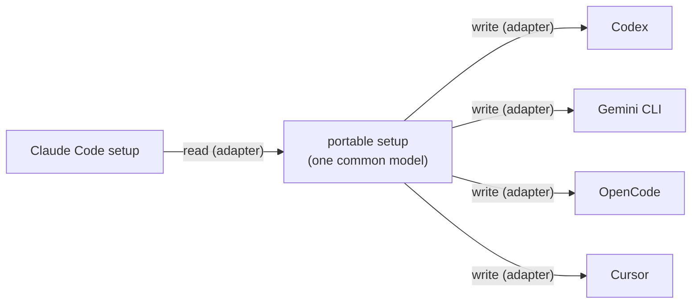

# Roadmap

Where agentnomad is today and where it is going. Dates are not promised; the order is.

| Stage                            | Theme                                                                                   | Status          |
| -------------------------------- | --------------------------------------------------------------------------------------- | --------------- |
| [v1](#v1-claude-code-everywhere) | Claude Code, on every OS, zero-knowledge                                                | Released as 1.0 |
| [v1.x](#v1x-more-agents)         | More agents: Codex, Gemini CLI, OpenCode, Cursor and others                             | Next            |
| [v1.x](#v1x-data-only-agents)    | Data-only agents: add a simple agent with a data file, no code                          | Planned         |
| [v2](#v2-one-setup-every-agent)  | One setup, every agent: turn a Claude Code setup into a Codex, Gemini or OpenCode setup | Planned         |
| [Later](#later)                  | History, teams, a dashboard, password change, storage                                   | Ideas           |

## v1: Claude Code everywhere

Everything in v1 is built and tested on macOS, Linux and Windows:

- Save and restore the global Claude Code setup and per-project setups: settings, `CLAUDE.md`,
  rules, skills, subagents, commands, workflows, output styles, themes, keybindings, hooks
  and the scripts they run, the status line, MCP servers.
- Plugins reinstalled with Claude Code's own commands; missing npm programs offered.
- Opt-in memory (subagent and auto memory) and opt-in environment variable values.
- Encrypted on the PC; the server never sees contents, project names or keys.
- Paths rewritten per PC and OS; merge, overwrite (with backup) or skip for existing files.
- Everything that runs programs is shown before it is written.
- Fully scriptable (`--yes`, `--password-stdin`, `--allow-commands`), with exit codes for CI.
- Cross-OS end-to-end tests (macOS → Windows → macOS, Linux → Windows → Linux) and a
  security review with a published [threat model](security/threat-model.md).

Released on npm as `agentnomad` 1.0, built and published by GitHub Actions with provenance.
A weekly check compares the Claude Code data file with the newest Claude Code and opens an
issue when something needs reviewing.

## v1.x: more agents

Each agent is a new adapter (see [ADDING-AN-AGENT.md](ADDING-AN-AGENT.md)). Existing saves
are never touched: data is stored per agent. Candidates, with what their setup is made of
(from each agent's documentation, September 2026; each adapter starts with checking them
again):

| Agent                 | Setup to sync                                                                                                                                                                        | Never sync                                                            | Notes                                                                                                                                             |
| --------------------- | ------------------------------------------------------------------------------------------------------------------------------------------------------------------------------------ | --------------------------------------------------------------------- | ------------------------------------------------------------------------------------------------------------------------------------------------- |
| **OpenAI Codex CLI**  | `~/.codex` (or `CODEX_HOME`): `config.toml` (settings and `[mcp_servers]`), global `AGENTS.md`; project `AGENTS.md`, `.codex/` config and skills; user skills in `~/.agents/skills/` | `auth.json`, `sessions/`, `archived_sessions/`, history               | Settings are TOML, so it needs a TOML merge strategy in core (JSON merge exists today).                                                           |
| **Google Gemini CLI** | `~/.gemini/settings.json` (settings and `mcpServers`), `GEMINI.md` context files, custom commands; project `.gemini/settings.json`, `GEMINI.md`                                      | `oauth_creds.json`, other credentials                                 | Extensions can be reinstalled like Claude Code plugins. System-wide settings files are organization-managed, like Claude Code's managed settings. |
| **OpenCode**          | `~/.config/opencode/opencode.json` (settings, MCP servers), skills in `~/.config/opencode/skills/`, agents and commands; project `opencode.json`, `AGENTS.md`, `.opencode/`          | Stored logins                                                         | OpenCode also reads Claude Code's and the shared `~/.agents/skills/` folders, so some skills already carry over.                                  |
| **Cursor**            | Project `.cursor/rules/*.mdc`, `AGENTS.md`, `.cursor/mcp.json`; global `~/.cursor/mcp.json`                                                                                          | Editor state, logins                                                  | User rules and most settings live inside the app, not in files, so the first version covers project rules and MCP servers.                        |
| **Claude Desktop**    | Local MCP servers from `claude_desktop_config.json` (secrets through the encrypted env section); desktop extensions reinstalled from a saved list; global scope only                 | Extension secrets kept in the OS keychain (entered again, not synced) | Planned in the v1 PRD as the first addition after Claude Code.                                                                                    |
| **Others**            | GitHub Copilot CLI, Windsurf, Cline, Continue, Aider, Amp, Kiro                                                                                                                      |                                                                       | Each needs its own research before an adapter. Requests welcome as issues.                                                                        |

What is shared by every new agent, so each adapter stays small:

- Push, pull, `list`, `status`, `delete`, `agents`, encryption, the server and the CLI
  flags work unchanged.
- `{{HOME}}` path rewriting, per-OS line endings and permissions, JSON merge, backups.
- The "runs programs" review. It currently understands Claude Code's hook, status line and
  MCP formats; it will move behind the adapter (an `inspector.runnable` hook) with the
  second agent, so each agent can describe its own.

## v1.x: data-only agents

Many agents are simple: a folder, some files and folders that are the setup, some that
must never be saved, and a file that holds MCP servers. For those, an adapter could be a
data file only, read by one generic adapter:

```json
{
  "id": "codex",
  "displayName": "Codex CLI",
  "detect": { "command": "codex", "folder": "~/.codex", "folderEnv": "CODEX_HOME" },
  "global": {
    "files": ["config.toml", "AGENTS.md"],
    "folders": ["prompts"],
    "neverSynced": ["auth.json", "sessions", "archived_sessions", "history.jsonl"]
  },
  "project": { "rootFiles": ["AGENTS.md"], "folders": [".codex/skills"] },
  "runnable": [{ "file": "config.toml", "format": "toml", "path": "mcp_servers.*.command" }]
}
```

The same schema checks as Claude Code's data file apply, so a mistake fails loudly at
start-up and in tests. Agents with special rules (Claude Code's `~/.claude.json`, plugins,
auto memory) keep a code adapter, which can still use the generic parts.

## v2: one setup, every agent

The goal: set up one agent and have the others follow. If your Claude Code setup has your
instructions, skills, MCP servers and commands, v2 can give Codex, Gemini CLI or OpenCode
the same setup, on this PC or any other.

### How it will work



1. **A portable setup model** in `contracts`: the parts most agents share.

   | Part                | Claude Code                 | Codex          | Gemini CLI         | OpenCode        | Cursor                |
   | ------------------- | --------------------------- | -------------- | ------------------ | --------------- | --------------------- |
   | Instructions        | `CLAUDE.md`                 | `AGENTS.md`    | `GEMINI.md`        | `AGENTS.md`     | `AGENTS.md`, rules    |
   | Skills (`SKILL.md`) | `skills/`                   | skills folders | via extensions     | skills folders  | –                     |
   | MCP servers         | `.claude.json`, `.mcp.json` | `config.toml`  | `settings.json`    | `opencode.json` | `mcp.json`            |
   | Commands / prompts  | `commands/*.md`             | prompts        | commands (`.toml`) | commands        | –                     |
   | Subagents           | `agents/*.md`               | –              | –                  | agents          | –                     |
   | Rules               | `rules/`                    | –              | –                  | instructions    | `.cursor/rules/*.mdc` |
   | Hooks               | `settings.json`             | –              | hooks              | plugins         | –                     |

   A dash means no equivalent was known when this was written. Agents change fast: each
   translator starts by checking the agent's current documentation.

2. **Translators in adapters.** Each adapter learns two more things: read its setup into
   the portable model, and write the portable model in its own format. Adding an agent to
   v2 is again one adapter; no agent knows about any other.
3. **A preview before anything is written.** For example
   `agentnomad convert --from claude-code --to codex` shows what maps to what, and what
   cannot be carried over (e.g. hooks, which most agents do not have), then asks. Existing
   files are merged, overwritten with a backup, or skipped, as in pull.
4. **Keep them in step.** Optionally, pull can also update the other agents from the saved
   setup, so one push reaches every agent on every PC.

### Principles

- Nothing is lost silently: anything that does not translate is listed.
- The original agent's setup stays the source of truth; translated files are marked as
  generated, so a later run can update them.
- The same safety rules as pull: anything that runs programs is shown first.
- Works offline too: converting on one PC needs no account.

## Later

Ideas outside the v1 scope, in no fixed order:

- **Change password** (fast by design: only the data key is re-wrapped).
- **Version history:** restore an earlier revision of a setup.
- **Selective sync:** choose single skills, commands or MCP servers.
- **Team sharing:** share a project setup with teammates (needs shared keys).
- **Web dashboard** to see saved setups and sessions (never their contents).
- **Background sync:** push or pull automatically when a setup changes.
- **Storage:** move encrypted bytes from Postgres to Cloudflare R2 (the `BlobStore`
  interface is ready).
- **An optional secret key** (like 1Password's) mixed into key derivation, for extra
  protection if the server database leaks.
- **Self-hosting guide** for running your own API.

Ideas and requests are welcome as [GitHub issues](https://github.com/A1X6/agent-nomad/issues).
